# Independent Architecture Challenge Review — Platform Users and Virtual Clinics

**Review date:** 2026-09-26
**Subject:** `platform-users-and-virtual-clinics-requirements.md` (revision 1, decision date 2026-09-25)
**Output:** this report + canonical revision 2 of the requirements document
**Repository baseline:** branch `codex/platform-control-plane` at `e4c7552` plus the uncommitted Virtual Clinic
slice (V53, `clinic` module, `ConsultantReferralService`, `ConsultantRoutingController`)
**Method:** requirements read in full; every implementation claim checked against executable code, migrations,
realm configuration and tests (evidence order: decisions → backend invariants → DB constraints → tests → ADRs →
UI → comments). Standards editions checked against publisher sites on the review date (see §D).

Status labels used on statements: CONFIRMED · CONTRADICTED · INCOMPLETE · AMBIGUOUS · NOT IMPLEMENTED ·
IMPLEMENTED BUT UNSAFE · DEFERRED BY DECISION.

---

## A. Executive verdict — **CONDITIONALLY CLOSED**

The business architecture is sound. One platform scope, independent Consultants with one Virtual Clinic each,
assignment-derived case access, Practice Managers as non-clinical delegates, and pre-production provider retirement
form a coherent model that is simpler and safer than the provider-organization model it replaces. None of the 20
frozen decisions needed to be reopened.

Revision 1 of the document was not closable as written, for three reasons:

1. **It overstated the implemented baseline.** It presented as implemented or safe several behaviours that the code
   contradicts. The most serious is that a Consultant holding a *pending* offer (initial, transfer or second
   opinion) can open the full case workspace and all documents today. A test asserts this behaviour
   (`ConsultantVirtualClinicTest.java:140`). Eligibility also admits a Consultant on their profile care area alone
   and on a single current credential, both of which frozen decisions forbid. A System Administrator can approve
   clinical capabilities.
2. **Authority was undefined in places that matter to patient safety.** The document did not say what happens to
   active cases when a Consultant's licence expires, their capability is revoked or they are suspended. It did not
   say who is authoritative for the patient lifecycle: the case state machine or the Journey runtime, which is
   flag-gated and off by default. It did not say how a missing Platform Account Owner is replaced.
3. **Cross-cutting requirements were missing.** Invariants were not stated in testable form. There was no data
   classification or retention, no consistency or recovery model for Keycloak-versus-database operations, no
   SLO/RTO/RPO, no jurisdiction statement, and no concrete provider-dependency inventory.

Revision 2 resolves every finding that confirmed decisions and evidence can resolve. It adds requirement IDs, a
testable invariant catalogue and failure/recovery requirements, and corrects the baseline claims. Six decisions
remain that only business, clinical-governance, privacy or legal authority can make. Each has a recommended option
and a fail-safe default, and each is attached to the delivery phase it gates.

**What this means for the business:** engineering can start the sequenced programme now. The first phase
(Phase 0) corrects the unsafe parts of the uncommitted Virtual Clinic slice before that slice is committed or
enabled anywhere. Production launch stays blocked until the jurisdiction and legal decision (OD-01) and the
recovery targets (OD-06) are made and the launch acceptance criteria pass.

---

## B. Critical challenge summary

| # | Weakness | Nature | Resolution in rev 2 |
|---|---|---|---|
| 1 | Pending offers and referral offers grant full case and document read (`authorizeRead` accepts `PENDING`) | IMPLEMENTED BUT UNSAFE; the document claimed the opposite | ASG-05, REF-04, INV-12; Phase 0 fix |
| 2 | Profile care area alone and one current document make a Consultant eligible | CONTRADICTED (frozen decisions 15, 16 and the "no single document" rule) | CNS-04, ELG-01; OD-03 fixes the credential set |
| 3 | System Administrator and Auditor realm roles bypass case read, coordinator ownership, referral confirmation, credential verification and capability approval | IMPLEMENTED BUT UNSAFE (new V53 code adds more) | SOD-08, ACG-08; Phase 0 removes the bypasses from V53 code |
| 4 | Transfer acceptance can race a final clinical decision and leave **zero** primary Consultants; re-offering can race to create two pending offers and then two active primaries | IMPLEMENTED BUT UNSAFE | INV-11, ASG-03, REF-08 (case-row lock, update-count checks, DB-enforced primary pointer) |
| 5 | Offer and referral acceptance does not recheck eligibility | IMPLEMENTED BUT UNSAFE | ASG-06, REF-06 |
| 6 | No clinical-continuity rule for credential expiry, capability revocation or suspension during active care | INCOMPLETE (patient-safety gap) | CNS-10..CNS-14; OD-05 sets the window |
| 7 | Business authority is realm-role based (`ActorContext`) while database assignments run in parallel; no self-grant or last-administrator guards; no MFA/`acr` verification | CONTRADICTED by frozen decision 18 (documented as REMAINING, but verification of MFA assurance was unspecified) | IAM-06..IAM-12, SOD-01..SOD-06 |
| 8 | Keycloak calls run inside database transactions with no durable identity-operation record (staff disable, Practice Manager invite) | IMPLEMENTED BUT UNSAFE | IDO-01..IDO-07 |
| 9 | Practice Manager delegation is `ACTIVE` at invitation; no consent, MFA, or existing-account reuse; delegate accounts keep the default `PATIENT` realm role | CONTRADICTED (the document listed consent as a requirement without a label) | PM-03..PM-08, IAM-11 |
| 10 | "Journey Instance" authority is ambiguous: the runtime is off by default and its V1 catalogue ends at `COMPLETE_PROFILE` | AMBIGUOUS | JRN-01..JRN-03 |
| 11 | Deleting a practitioner cascades away clinic history and capability decisions | IMPLEMENTED BUT UNSAFE | DAT-06 |
| 12 | Owner recovery, break-glass, recertification, dormant and service accounts, jurisdiction, retention and RTO/RPO were absent | INCOMPLETE | GOV-08, IAM-14..IAM-17, PRV-01, OPS-01; OD-01, OD-02, OD-06 |

---

## C. Findings register

Evidence paths are relative to the repository root. "Blocks approval" means approval of the architecture. Where a
finding is resolved in rev 2 but the code still has the defect, the implementation gate is stated separately.

### F-01 — Pending assignments grant full case and document access
- **Severity:** BLOCKER · **Domain:** Clinical access / privacy
- **Reference:** rev 1 §2.2 (Referrals row), §2.8, §2.9 (1, 6), §2.10 (4); `docs/consultant-virtual-clinic.md` ("pending status grants no access")
- **Evidence:** `JourneyService.authorizeRead` (`JourneyService.java:861`) accepts any `case_assignments` row with
  `status IN ('PENDING','ACTIVE')`. `workspace()` (`:133`) and `assertCanReadDocument()` (`:131`) rely on it.
  `requireAcceptedStaffAssignment` protects only `message` and `task`. `ConsultantVirtualClinicTest.java:140`
  asserts that a Consultant holding a *pending transfer offer* opens `journey.workspace(caseId)`.
- **Current behaviour:** Any Consultant offered a case, transfer or second opinion reads the full workspace,
  documents and timeline before accepting. After declining, access ends, but the disclosure has already happened.
- **Target:** A pending offer grants only the server-shaped offer preview. Full access requires an `ACTIVE` primary
  assignment. A second opinion gets read-only access while `ACTIVE`.
- **Risk:** Health data disclosed to clinicians with no care relationship; breaks the minimum-necessary principle
  and frozen decision 7.
- **Correction:** Split staff read authorization. Only `ACTIVE` non-referral assignments, and `ACTIVE SECOND_OPINION`
  assignments for read-only use, pass `authorizeRead`. `PENDING` reaches only `GET /offers/{id}/preview`. Invert the
  test at line 140.
- **Acceptance test:** For each of initial offer, transfer offer and second-opinion offer in `PENDING`,
  `DECLINED`, `ENDED` and `EXPIRED` states, `workspace`, document list, download, messages and timeline return 403,
  and the preview returns only the approved fields (OD-04).
- **Standard:** OWASP API Security Top 10 2023 API1 (BOLA); OWASP ASVS 5.0.0 access-control chapter; ISO 27799:2025
  access-control guidance (licensed-text mapping required); minimum-necessary principle.
- **Blocks approval:** No. Rev 2 ASG-05, REF-04 and INV-12 are unambiguous. **Blocks committing or enabling the V53
  slice (Phase 0).**

### F-02 — Profile care area alone makes a Consultant assignable
- **Severity:** HIGH · **Domain:** Clinical eligibility
- **Reference:** Frozen decision 16; rev 1 §2.2 ("matching care area/capability"), §2.8
- **Evidence:** `ConsultantEligibilityService.ELIGIBLE_WHERE`: `p.care_category=:area OR EXISTS(... capability_type='CARE_AREA' ... 'APPROVED')`.
  Eligibility reason `PRIMARY_CARE_AREA` is returned to coordinators.
- **Current:** A self-declared or administrator-entered profile care area authorizes assignment.
- **Target:** An approved `CARE_AREA` capability is required. The profile care area is display and search only.
- **Risk:** Clinical work routed on an unapproved declaration.
- **Correction:** Remove the `p.care_category` branch. Pre-production parity: generate one capability-review work
  item per Consultant whose eligibility currently depends on the profile branch. Do **not** backfill approvals
  automatically, because that would infer capability from the profile.
- **Acceptance test:** A Consultant with primary care area X and no approved `CARE_AREA:X` capability is absent from
  `eligible(X)`, and `assignConsultant` returns 409.
- **Standard:** Frozen decision; ISO 31000:2018 risk treatment; patient-safety principle.
- **Blocks approval:** No (resolved by ELG-01). Implementation gate: Phase 0.

### F-03 — One current credential makes a Consultant eligible
- **Severity:** HIGH · **Domain:** Credentialing
- **Reference:** rev 1 §2.3 ("One valid document must never…"); frozen decision 14
- **Evidence:** `ELIGIBLE_WHERE` requires `credentialing_status='VERIFIED'` and `EXISTS` one `VERIFIED`, unexpired
  `practitioner_credentials` row. `CredentialExpiryService.expireCredentials` sets the profile to `EXPIRED` only
  when **no** credential remains current.
- **Current:** An expired licence is masked by any other current document, for example a passport.
- **Target:** Every mandatory credential requirement for the Consultant's professional type and jurisdiction is
  satisfied and current.
- **Risk:** A clinician with a lapsed licence stays assignable.
- **Correction:** Add `credential_requirement_policies` (versioned) and per-requirement satisfaction evaluation. Both
  eligibility and the expiry job evaluate *requirements*, not "any document".
- **Acceptance test:** Consultant with a current identity document and an expired licence → not eligible, lifecycle
  becomes `RESTRICTED`, pending offers withdrawn.
- **Standard:** Frozen decision; ISO 27799:2025 (workforce/credential assurance, licensed mapping).
- **Blocks approval:** No. **OD-03** (the mandatory credential set) gates Phase 5.

### F-04 — Administrator and auditor clinical and operational bypasses, including in new code
- **Severity:** HIGH · **Domain:** IAM / segregation of duties
- **Reference:** Frozen decisions 10, 11, 13; rev 1 §1.2, §1.4, §1.6 (8)
- **Evidence:** `authorizeRead` returns early for `SYSTEM_ADMIN` and `AUDITOR`. `requireCoordinatorOwnership`
  (`JourneyService.java:863`, `ConsultantReferralService.java:331`) returns early for `SYSTEM_ADMIN`.
  `ConsultantReferralService.confirm/decline` allow `SYSTEM_ADMIN`. `ConsultantCapabilityService.governor` allows
  `SYSTEM_ADMIN` to approve and revoke capabilities. `verifyPractitioner` (`:433`) allows `SYSTEM_ADMIN`.
  `setPractitionerEnabled` (`:430`, the only suspension tool) is `SYSTEM_ADMIN` only.
- **Current:** The System Administrator is a de facto clinical, credential and routing super-user. The Auditor reads
  all clinical content.
- **Target:** No administrator or auditor clinical bypass. Capability and credential decisions belong to the
  Credential Verification Officer. Consultant suspension belongs to Consultant Operations. Audit review sees
  metadata by default; clinical content only through a recorded, time-bounded audit case.
- **Risk:** Privileged-account compromise equals full health-data compromise; segregation-of-duties failure.
- **Correction:** Phase 0 removes `SYSTEM_ADMIN` from all V53 code paths. Phase 1 removes existing bypasses per
  ACG-08, with negative tests for each.
- **Acceptance test:** A `SYSTEM_ADMIN` token gets 403 on case workspace, documents, referral confirm, capability
  approve/revoke and credential verify. An `AUDITOR` token gets audit metadata but 403 on documents without an
  active audit-case grant.
- **Standard:** ISO/IEC 27002:2022 (segregation of duties, privileged access rights; licensed mapping); NIST CSF 2.0
  PR.AA; OWASP API5:2023 (broken function-level authorization).
- **Blocks approval:** No (SOD-08, ACG-08).

### F-05 — Transfer acceptance racing a final clinical decision can leave zero primary Consultants
- **Severity:** HIGH · **Domain:** Concurrency / patient safety
- **Reference:** rev 1 §2.10 (6, 11)
- **Evidence:** `ConsultantReferralService.decide` (`:215–277`) checks case status without a row lock. It issues
  `UPDATE … SET status='ENDED' … AND status='ACTIVE'` (source) and `UPDATE … SET status='ACTIVE' … AND status='PENDING'`
  (target) **without checking update counts**, then sets the referral to `COMPLETED` without a version guard.
  `reviewDecision` → `withdrawOpenTransfers` ends the pending target assignment.
- **Scenario:** The clinical decision commits first (target → `ENDED`, referral `WITHDRAWN`). Acceptance then runs:
  the source update succeeds, the target update affects 0 rows, and the referral becomes `COMPLETED`. The case is
  left with no primary Consultant.
- **Target:** Exactly one active primary at every commit.
- **Correction:** Every referral and assignment command takes `SELECT … FROM medical_cases WHERE id=? FOR UPDATE`
  first. Every conditional update must affect exactly 1 row, otherwise throw 409 and roll back. Referral updates use
  version guards.
- **Acceptance test:** A two-thread test (accept vs. clinical decision) yields exactly one of {transfer completed
  with the new primary, transfer withdrawn with the original primary}. Never zero, never two.
- **Standard:** ISO/IEC 25010:2023 reliability/integrity; patient-safety invariant.
- **Blocks approval:** No (REF-08, INV-11).

### F-06 — Exactly-one-primary is not enforced for initial offers
- **Severity:** HIGH · **Domain:** Concurrency / data integrity
- **Reference:** rev 1 §2.8, §2.9 (2, 5)
- **Evidence:** `assign` (`:192`) ends existing `PENDING`/`ACTIVE` rows then inserts a new row, with no case-row
  lock. `transitionWithoutVersion` (`:865`) returns early when the case is already in the target state, so a
  re-offer from `CONSULTANT_ASSIGNMENT_PENDING` bumps no version. `decideAssignment` (`:306`) does not check for
  another active primary. `case_assignments` has no uniqueness constraint (V2 indexes only).
- **Scenario:** Two concurrent re-offers (owner coordinator plus a `SYSTEM_ADMIN`, or a retried request) create two
  `PENDING` doctor rows. Both Consultants accept, and the second acceptance hits the same early return, leaving two
  active primaries.
- **Correction:** Case-row lock in `assign`/`decideAssignment`. Add a DB-enforced pointer:
  `case_primary_consultant(case_id PK, assignment_id UNIQUE)`, which is H2-safe (no partial index). Acceptance
  inserts it; transfer updates it under lock.
- **Acceptance test:** Concurrency test with parallel re-offer and parallel acceptance; the DB rejects a second primary.
- **Standard:** ISO/IEC 25010:2023 functional correctness.
- **Blocks approval:** No (ASG-03, INV-11).

### F-07 — Acceptance does not recheck eligibility
- **Severity:** HIGH · **Domain:** Clinical eligibility
- **Reference:** rev 1 §2.9 (5) (REMAINING); §2.10 is silent
- **Evidence:** Neither `decideAssignment` nor `ConsultantReferralService.decide` calls `isEligible`.
- **Current:** A Consultant whose licence expired, who was suspended or who became unavailable after the offer can
  still accept it.
- **Correction:** Recheck eligibility inside the locked transaction. On failure, return 409 `CONSULTANT_NO_LONGER_ELIGIBLE`,
  withdraw the offer and notify the Coordinator.
- **Acceptance test:** Expire the licence between offer and acceptance → acceptance refused, offer `WITHDRAWN`, one
  Coordinator work item.
- **Standard:** Patient-safety principle; ASVS 5.0.0 business-logic verification.
- **Blocks approval:** No (ASG-06, REF-06).

### F-08 — No clinical-continuity rule when eligibility is lost during active care
- **Severity:** HIGH · **Domain:** Patient safety / Consultant lifecycle
- **Reference:** rev 1 §2.3 (covers offboarding only)
- **Evidence:** `CredentialExpiryService` sets `credentialing_status='EXPIRED'` and `availability_status='UNAVAILABLE'`.
  `requireActiveAssignment` (`:878`) checks only the assignment row, so clinical writes (`reviewDecision`,
  `approveClinicalReview`, `treatment`, `followUp`) continue on active cases. Pending offers and referrals are not
  withdrawn, and no Coordinator work is raised.
- **Target:** Loss of eligibility has a defined, audited effect on pending offers, active assignments, clinical
  writes and handover.
- **Risk:** Clinical decisions recorded by a Consultant without a current licence; patients stranded.
- **Correction:** CNS-10..CNS-14: an eligibility-loss event is recorded; pending offers are withdrawn; clinical
  writes are blocked for licence/registration lapse and for suspension; read access remains for handover; an
  urgent Coordinator reassignment item is raised; emergency suspension ends access immediately. **OD-05** sets the
  handover window and whether capability revocation affects active cases.
- **Acceptance test:** Expire the licence with 1 active case, 1 pending offer and 1 pending referral → offer and
  referral withdrawn, `reviewDecision` returns 409 `CLINICAL_AUTHORITY_SUSPENDED`, workspace readable until
  reassignment, one urgent work item.
- **Standard:** ISO 31000:2018; ISO 22301:2019 (continuity of critical activities).
- **Blocks approval:** No (default set). OD-05 gates Phase 5.

### F-09 — No self-grant, self-revoke, last-owner or last-administrator protection
- **Severity:** HIGH · **Domain:** IAM governance
- **Reference:** rev 1 §1.4; §2.16 (1)
- **Evidence:** `RoleAssignmentService.grant` has no `subject ≠ actor` check. For platform-scope, journey-delegable
  roles it skips the "grantor must hold the permission" check. `revoke` has no self-revoke and no
  last-effective-administrator check. There is no privileged-change request table. `AccessBootstrapService` is
  one-shot (CONFIRMED).
- **Correction:** SOD-01..SOD-06, GOV-04..GOV-07: `privileged_change_requests` (maker ≠ checker, recent auth,
  reason, expiry, version); counting invariants evaluated inside the same transaction under a governance lock.
- **Acceptance test:** Self-grant → 403 `SELF_GRANT_PROHIBITED`. Revoking the last effective System Administrator
  → 409 `LAST_ADMINISTRATOR`. Two administrators revoking each other concurrently → one succeeds.
- **Standard:** ISO/IEC 27002:2022 privileged access; NIST CSF 2.0 PR.AA; ASVS 5.0.0 authorization.
- **Blocks approval:** No.

### F-10 — Business authorization comes from Keycloak realm roles
- **Severity:** HIGH · **Domain:** IAM
- **Reference:** Frozen decision 18; rev 1 §1.5, §1.6 (7)
- **Evidence:** Every case, finance and clinical command uses `ActorContext.require(ActorRole…)`, built by
  `JwtRoleConverter` from `realm_access.roles` **and** a top-level `roles` claim. Database assignments
  (`AuthorizationService`) govern only the access-governance, journey, coordination and provider APIs. No
  per-request check of `staff_members`/`practitioner_profiles` lifecycle state.
- **Current:** A revoked DB assignment does not remove realm-role authority. Keycloak is the effective business
  authorization engine.
- **Correction:** IAM-06..IAM-09: a per-request authority resolver backed by the database (lifecycle `ACTIVE` plus an
  effective assignment). Realm roles become authentication-policy classifiers only. Cut over per endpoint family
  with parity tests. Restrict `JwtRoleConverter` to `realm_access`.
- **Acceptance test:** Revoke the DB assignment while the realm role remains → 403 on the next request.
  Disable the staff member in the DB → 403 on the next request, before token expiry.
- **Standard:** NIST SP 800-207 (per-request policy decision); OWASP Top 10:2025 A01.
- **Blocks approval:** No (sequenced in delivery Phase 3).

### F-11 — MFA not enforced or verified
- **Severity:** HIGH · **Domain:** Authentication assurance
- **Reference:** rev 1 §1.5 (MFA REMAINING)
- **Evidence:** The realm export has no OTP/WebAuthn required action or conditional-OTP flow. `ActorContext` reads
  `auth_time` (CONFIRMED fail-closed: missing → epoch, future skew > 60 s rejected) but never `acr`/`amr`.
- **Gap:** The document did not say how the backend verifies that MFA happened.
- **Correction:** IAM-03..IAM-05: Keycloak acr-to-LoA mapping. The backend requires `acr` ≥ the workforce level on
  every workforce route. Step-up uses `acr_values` + `max_age`. Phishing-resistant authenticators (WebAuthn/passkey)
  are required for the Platform Account Owner and System Administrators.
- **Acceptance test:** A workforce token without the MFA `acr` → 401 `MFA_REQUIRED`. An administrator token with
  OTP-only `acr` → 401 on privileged commands.
- **Standard:** NIST SP 800-63B-4 (AAL2/AAL3, phishing resistance); RFC 9700; ASVS 5.0.0 authentication.
- **Blocks approval:** No.

### F-12 — Identity-provider side effects inside database transactions
- **Severity:** HIGH · **Domain:** Distributed consistency
- **Reference:** rev 1 §1.7 (3, 7, 8)
- **Evidence:** `setStaffEnabled`/`setPractitionerEnabled` call `KeycloakStaffIdentityService.setEnabled` *before*
  the DB update, inside `@Transactional`, and never call Keycloak session logout.
  `VirtualClinicService.inviteManager` creates the Keycloak user, then inserts the delegation. A DB failure leaves
  an orphan identity (the idempotent `inviteTracked`/`recover` marker exists but is not used here).
- **Correction:** IDO-01..IDO-07: `identity_operations` table written in the business transaction; after-commit
  worker; operation marker for creation; logout-all-sessions on disable; reconciliation job; operator retry view.
- **Acceptance test:** Force a DB failure after the Keycloak call → no Keycloak change persists (the operation
  runs only after commit). Force a Keycloak 503 → business state committed, operation `RETRYING`, visible, and
  eventually `SUCCEEDED`.
- **Standard:** ISO/IEC 25010:2023 reliability; ISO 22301:2019.
- **Blocks approval:** No.

### F-13 — Practice Manager delegation lacks consent, MFA, existing-identity reuse, and patient-role isolation
- **Severity:** HIGH · **Domain:** Delegation / IAM
- **Reference:** rev 1 §2.6 (3, 4, 6, 12), unlabelled
- **Evidence:** V53 `practice_managers.status IN ('ACTIVE','REVOKED')`, inserted as `ACTIVE`. `updateManager` can
  widen permissions and reinstate `REVOKED → ACTIVE` with no consent and no recent auth. `invite()` refuses existing
  identities (`STAFF_EMAIL_EXISTS`). The realm `defaultRoles: ["PATIENT"]`; delegate-only accounts keep `PATIENT`
  (staff invites strip it; Practice Manager invites pass `role=null`).
- **Correction:** PM-03..PM-08 (state machine `INVITED → ACTIVE → SUSPENDED → REVOKED`, single-use expiring
  invitation bound to email and accepted by the authenticated identity with MFA; consent record; widening creates a
  pending grant; reinstatement is a new invitation). IAM-11: an identity holds `PATIENT` only with a
  `patient_profiles` relationship.
- **Acceptance test:** An invited, unaccepted manager → 403 on the clinic. Widening → no new permission until
  accepted. A delegate-only account → 403 on `/api/v1/patient/**`.
- **Standard:** NIST SP 800-63A-4 (enrolment binding); ASVS 5.0.0; OWASP API3:2023 (object-property authorization).
- **Blocks approval:** No.

### F-14 — Journey Instance authority is ambiguous
- **Severity:** HIGH · **Domain:** Journey / lifecycle authority
- **Reference:** Frozen decision 17; rev 1 §2.11 ("IMPLEMENTED foundation … same instance must govern")
- **Evidence:** `application.yml:80,85`: `journey.runtime.enabled` and `production-intake-enabled` default `false`.
  `journey-parity-status.md`: the frozen V1 catalogue covers 11 actions up to `COMPLETE_PROFILE` and has no
  vocabulary for arrival, treatment, discharge, follow-up, cancellation or referral. The authoritative lifecycle is
  `medical_cases.status` under `CaseTransitionPolicy`. `ACCEPTED → TRAVEL_COORDINATION` is implemented
  **correctly** (`CaseHandoffService:137–146`: row lock, status-guarded update, `entryBlockers`, idempotent) —
  CONFIRMED.
- **Risk:** Two lifecycle authorities, or engineers treating a shadow runtime as authoritative.
- **Correction:** JRN-01..JRN-03: the business Journey Instance is the case lifecycle record. Its authoritative
  state is `medical_cases.status` plus history under `CaseTransitionPolicy`. The pinned runtime instance is an
  execution projection that may take authority only stage by stage after recorded parity. Activation semantics are
  unchanged.
- **Acceptance test:** With the runtime disabled, the full lifecycle and activation tests pass. With it enabled,
  shadow comparison reports `MATCH` for the activation boundary.
- **Blocks approval:** No.

### F-15 — Activation handoff has no scheduled reconciliation
- **Severity:** MEDIUM · **Domain:** Reliability
- **Evidence:** The handoff runs from synchronous `@EventListener`s (same transaction; CONFIRMED no event loss on
  commit). The only `@Scheduled` jobs are coordination retry, credential expiry, proposal expiry and the
  notification outbox. A gate satisfied by a path that publishes no event is repaired only by read-time
  `CaseActionService.resolve`.
- **Correction:** OPS-05: a reconciliation sweep for cases in `ACCEPTED` with zero entry blockers, plus a metric and
  alert.
- **Blocks approval:** No.

### F-16 — No expiry for referral offers or second-opinion access
- **Severity:** MEDIUM · **Domain:** Access lifecycle
- **Evidence:** `case_assignments` and `consultant_referrals` have no `expires_at`. Second-opinion access ends only
  on submission.
- **Correction:** REF-05, REF-07: `expires_at` snapshot at confirmation and at acceptance; a scheduler ends them
  idempotently.
- **Acceptance test:** Time travel past expiry → the assignment is `EXPIRED`, workspace 403, one Coordinator
  notification.
- **Blocks approval:** No.

### F-17 — Referral withdrawal and post-arrival referral not implemented
- **Severity:** MEDIUM · **Evidence:** `ConsultantReferralService` has no withdraw command. `create` requires
  `CONSULTANT_REVIEW`. `docs/consultant-virtual-clinic.md` §5 item 6 lists these as deferred.
- **Correction:** Label REF-10 REMAINING. Post-arrival referral is DEFERRED (REF-12).
- **Blocks approval:** No.

### F-18 — Free-text reasons stored and propagated in plaintext; audit is mutable
- **Severity:** MEDIUM · **Domain:** Privacy / audit
- **Evidence:** Coordinator decline notes and receiver decline reasons go into `audit_events.reason`,
  `staff_notifications.context` and work-item text in plaintext. Only `clinical_reason_encrypted` and
  `opinion_encrypted` are encrypted. Staff emails carry only the title (CONFIRMED safe: `StaffWorkService.notifyStaff`).
  `audit_events` has no append-only enforcement.
- **Correction:** SEC-06, DAT-04, AUD-03: treat referral-related free text as clinical (encrypted, excluded from
  audit reason and notification text). Grant the production application database role INSERT/SELECT only on audit
  tables. Export audit to write-once storage.
- **Standard:** ISO 27789:2021 (current edition; a revision is in progress); ISO/IEC 27002:2022 logging.
- **Blocks approval:** No.

### F-19 — Cascading deletes erase clinic and capability history
- **Severity:** MEDIUM · **Evidence:** V53 `virtual_clinics … REFERENCES practitioner_profiles(id) ON DELETE CASCADE`,
  cascading to `practice_managers`, `consultation_slots` and `clinic_service_changes`; `consultant_capabilities …
  ON DELETE CASCADE`.
- **Correction:** DAT-06: a new migration replaces these with `ON DELETE RESTRICT`. Practitioners are never
  physically deleted by application code.
- **Blocks approval:** No.

### F-20 — Capability decisions lack evidence, reason and history
- **Severity:** MEDIUM · **Evidence:** `ConsultantCapabilityService.approve` upserts in place (overwrites
  `approved_by`/`approved_at`), takes no reason and no evidence reference, and needs no recent authentication.
- **Correction:** CAP-03..CAP-06: an append-only `consultant_capability_decisions` table (decision, reason,
  supporting credential IDs, actor, recent auth, optional expiry). Current state is derived from it.
- **Blocks approval:** No.

### F-21 — Consultant lifecycle not modelled in data
- **Severity:** MEDIUM · **Evidence:** State is spread across `account_status`, `credentialing_status`,
  `availability_status` and `disabled_at`. There is no `SUSPENDED`. Suspension is only `setPractitionerEnabled`
  (Keycloak disable, `SYSTEM_ADMIN`).
- **Correction:** CNS-01..CNS-03: an explicit lifecycle column, a transition table with authority, and a
  `RESTRICTED` state for system-driven eligibility loss (distinct from disciplinary `SUSPENDED`).
- **Blocks approval:** No.

### F-22 — Suspended or disabled Consultants keep Virtual Clinic write access
- **Severity:** MEDIUM · **Evidence:** `VirtualClinicService.access` treats any `DOCTOR` token whose subject owns the
  profile as owner, with no lifecycle check. Delegates are gated only on `account_status`/`disabled_at`.
- **Correction:** VC-08: clinic mutations require an owner lifecycle other than `SUSPENDED`/`OFFBOARDING`/`OFFBOARDED`.
  Suspension withdraws the public profile and suspends delegations.
- **Blocks approval:** No.

### F-23 — Token audience and claim sources too broad
- **Severity:** MEDIUM · **Evidence:** `KeycloakClientTokenValidator` accepts `aud ∋ rehletshifaa-web` **or**
  `azp = rehletshifaa-web`, so the public SPA client ID doubles as the API audience. `JwtRoleConverter` also trusts
  a top-level `roles` claim.
- **Correction:** IAM-01, IAM-02: a dedicated API audience (`rehletshifaa-api`) via an audience mapper, a strict `aud`
  check plus an `azp` allowlist, and realm roles from `realm_access` only.
- **Standard:** RFC 9700 (audience-restricted tokens); ASVS 5.0.0 OAuth/OIDC chapter.
- **Blocks approval:** No.

### F-24 — Session persistence after disable
- **Severity:** MEDIUM · **Evidence:** No Keycloak logout call. No per-request lifecycle check. The realm export sets
  no token lifespans (Keycloak defaults apply).
- **Correction:** IAM-08 (per-request DB lifecycle check: authority ends at commit), IDO-04 (logout all sessions,
  retried), IAM-10 (access-token lifespan ≤ 5 minutes, set explicitly).
- **Blocks approval:** No.

### F-25 — Owner recovery and transfer undefined
- **Severity:** MEDIUM · **Domain:** Governance
- **Evidence:** No owner relationship exists yet (`PLATFORM_OWNER` is a role template, V31).
- **Correction:** GOV-08 plus **OD-02**. Default: the platform keeps operating under the System Administrators;
  ownership-only commands are unavailable until a recovery succeeds.
- **Blocks approval:** No (fail-safe default).

### F-26 — Break-glass, recertification, dormant and service accounts, and account recovery undefined
- **Severity:** MEDIUM · **Correction:** IAM-13..IAM-17, SUP-01..SUP-04: no clinical break-glass at launch;
  identity-platform recovery through sealed dual-control credentials; quarterly privileged review; 90-day dormancy
  disable; service-account registry; MFA reset needs System Administrator maker/checker.
- **Standard:** ISO/IEC 27002:2022; NIST SP 800-63B-4 (authenticator lifecycle, recovery).
- **Blocks approval:** No.

### F-27 — Jurisdiction, legal basis, residency and retention not identified
- **Severity:** MEDIUM (production BLOCKER) · **Domain:** Legal / privacy
- **Evidence:** EGP base currency (V53) implies Egyptian practice. Patients are international. No jurisdiction
  statement exists anywhere in the canonical documents.
- **Correction:** PRV-01..PRV-05 plus **OD-01** (legal questions listed). The fail-safe default is recorded.
- **Blocks approval:** No. **Blocks production launch.**

### F-28 — No data classification or retention model
- **Severity:** MEDIUM · **Correction:** DAT-01..DAT-08 (categories, owners, encryption, retention placeholders
  bound to OD-01, legal hold, no physical deletion until decided).
- **Blocks approval:** No.

### F-29 — No SLO, RTO/RPO, restore testing or alerting requirements
- **Severity:** MEDIUM · **Correction:** OPS-01..OPS-09 plus **OD-06**.
- **Blocks approval:** No. Blocks production launch.

### F-30 — Consultant Operations versus Credential Verification segregation not implementable as written
- **Severity:** MEDIUM · **Evidence:** No record of which Consultant Operations user onboarded or owns a Consultant.
- **Correction:** SOD-05 adds a `consultant_operations_owner` relationship, and the conflict check runs against it.
- **Blocks approval:** No.

### F-31 — Provider-retirement inventory not concrete; rollback boundary undefined
- **Severity:** MEDIUM · **Evidence:** See §I. Access assignments require an `access_memberships (subject, organization_id)`
  row even for platform scope (V31). Coordination tables are keyed by `organization_id`.
  `AssignmentEngine.guardLegacyWrite` blocks legacy writes for `LIVE` organization routing. `CredentialExpiryService`
  skips consultants with `clinician_onboardings.credential_policy_cutover_at`. `PricingCatalogService` →
  `ProviderPricingCatalogPort`; `clinic` → `ProviderCredentialEligibility`.
- **Correction:** RET-01..RET-12 with the dependency table and a rollback boundary.
- **Blocks approval:** No.

### F-32 — Offer preview dataset (open) — recommended content provided
- **Severity:** LOW · **Correction:** OD-04 recommended option; the fail-safe default excludes everything
  patient-authored.
- **Blocks approval:** No.

### F-33 — Staffing requests, support recovery process and "manager responsibility" roles undefined
- **Severity:** LOW · **Evidence:** Rev 1 §1.3 names "Operations Manager responsibility" and "Finance Manager
  responsibility", which are absent from the role catalogue. "Approved recovery process" for Support is undefined.
- **Correction:** STF-11 (staffing request handoff), SUP-01..SUP-04, ROLE-02 (supervisory responsibilities are
  team/reporting relationships plus the same base role, not new roles).
- **Blocks approval:** No.

### F-34 — Regulated-software scope not assessed
- **Severity:** OBSERVATION · **Assessment:** Eligibility, routing, capability matching and the commercial workflow
  are administrative. Clinical recommendations are authored by licensed Consultants, with no algorithmic diagnosis,
  triage scoring or treatment suggestion. On current evidence RehletShifaa is not Software as a Medical Device, so
  IEC 62304, ISO 14971 and IEC 82304-1 are **not applicable**.
- **Correction:** REG-01 is a tripwire: any automated triage, risk scoring, clinical suggestion, or AI summarisation
  shown to clinicians triggers a formal regulatory classification before build.

### F-35 — Accessibility baseline incomplete
- **Severity:** LOW · **Evidence:** Rev 1 §2.17 requires 390 px checks only and names no WCAG level.
- **Correction:** UX-01..UX-05 (WCAG 2.2 AA, 320–390 px, RTL, screen reader, privacy-safe notification copy).

### F-36 — Virtual Clinic lazy creation (document accurate)
- **Severity:** OBSERVATION · **Evidence:** `VirtualClinicService.access` → `ensureClinic` runs an INSERT on read.
  The document labels this correctly — CONFIRMED. VC-02 keeps the REMAINING target.

### F-37 — `clinic` depends on the retired `provider` module
- **Severity:** OBSERVATION · CONFIRMED (`ConsultantEligibilityService` imports `ProviderCredentialEligibility`).
  The document requirement is correct (CRD-07); RET-09 adds an ArchUnit rule.

---

## C2. Addendum — workforce role and hierarchy findings (F-38..F-47)

**Scope gap in the first pass.** The first pass verified the access-governance module (V31, `RoleAssignmentService`,
`AuthorizationService`). It did not inspect the separately implemented workforce hierarchy (`staff_members`,
`staff_team_assignments`, `coordinator_teams`, `PortalExperienceService`). It also left the hierarchy folded into
Phase 3 with no deliverables. The product owner identified this as the most critical part of the platform-users
architecture. The findings below close the gap, and rev 2 now has §1.3a (WF-01..WF-17), Phase 2A, INV-26..INV-29,
and OD-09.

| ID | Severity | Evidence | Current behaviour | Correction (rev 2) | Acceptance test | Blocks approval |
|---|---|---|---|---|---|---|
| F-38 | **HIGH** | `staff_members.ck_staff_role` (V20): only `COORDINATOR`, `OPERATIONS`, `FINANCE` and their `_LEAD` variants; `createStaff`/`setStaffEnabled` depend on it | 9 of 12 internal roles (SysAdmin, Consultant Ops, CredVer, Journey Mgr/Approver, Auditor, Support, Patient Identity) have no workforce record, lifecycle, manager, team, or offboarding | WF-01, INV-26 | Invite each of the 12 roles → workforce record + assignment; offboard each → access ends | No (resolved by WF-01) |
| F-39 | **HIGH** | Single `staff_role` column; role also held as a realm role and in `role_assignments` | One responsibility per person; three sources of truth for “what is this person's role” | WF-02 | A person holds two compatible roles; a conflicting pair is rejected; `staff_role` is not read by any authorization path | No |
| F-40 | **HIGH** | V22 `staff_team_assignments` vs V36 `coordinator_teams`/`coordinator_memberships` (org-keyed, own `team_lead`) | Two team models; coordination routing teams tied to provider organizations | WF-04, INV-29, RET-03 | One team table set; the routing test passes on platform teams | No |
| F-41 | **HIGH** | `ConsultantReferralService.requireCoordinatorRead` (`:338`), `requireAcceptedStaffAssignment`, `ROLE_THREADS`/`allowedThreads` (`JourneyService.java:349–351`), `cancelTask`/`reassignTask` | `COORDINATOR_LEAD` bypasses referral read, thread limits, and the accepted-assignment check platform-wide, not only for their team | WF-09, INV-28 | A lead gets 403 on a case with no team member assigned | No |
| F-42 | MEDIUM | `*_LEAD` staff roles + Keycloak composites; `leadFunctions()` | A lead is a role, not a relationship; supervision cannot be scoped to one team or one function | WF-06, WF-07, ROLE-02 | Removing a lead designation removes supervisory actions on the next request | No |
| F-43 | MEDIUM | V22 PK = `staff_subject`; `staff_function` derived from `staff_role` | One team and one manager per person across all functions | WF-05, INV-27 | A person has different managers in two functions; a second manager in the same function is rejected | No |
| F-44 | MEDIUM | `PortalExperienceService.reports()` walks recursively; `canLeadRead` counts `PENDING` assignments | Upper managers read cases across the whole subtree; pending offers extend visibility | WF-08, OD-09 | Visibility matches OD-09; a pending offer to a report grants the lead nothing | No |
| F-45 | MEDIUM | `updateReporting` requires `SYSTEM_ADMIN` | Function managers cannot manage their own teams (contradicts D-13); the System Administrator becomes the team administrator | WF-10 | Care Coordination Manager edits coordination teams; SysAdmin cannot edit teams without that role | No |
| F-46 | MEDIUM | No offboarding or role-removal checks on team leadership | Removing the only lead strands the team; direct reports are left without a manager | WF-12 | Removing the sole lead with members → 409 until members are re-parented | No |
| F-47 | LOW | Hierarchy code in `journey.application.PortalExperienceService` | Workforce concerns are coupled to the case module | WF-15 | ArchUnit: `workforce` has no dependency on `journey`/`provider` | No |

These findings do not change the frozen decisions. They make D-11, D-12 and D-13 implementable. Phase 2A is
inserted before Phase 3 because database authority (IAM-06) needs complete workforce records and one team model.

---

## D. Standards applicability matrix

Editions marked ✔ were confirmed on the publisher's site on 2026-09-26. Others are the reviewer's current
understanding and must be re-confirmed at control-mapping time. ISO/IEC clause text is not reproduced; a
licensed-text control mapping is required for any certification claim.

| Standard | Current edition | Primary source | Status | Architecture concern | Evidence required | Gap | Action | Target |
|---|---|---|---|---|---|---|---|---|
| ISO/IEC/IEEE 42010 | 2022 | iso.org | Partly applicable | Stakeholders, concerns, viewpoints, decisions | Viewpoint/decision records | Rev 1 had no decision/rationale traceability | §E views + §L matrix + requirement IDs | Guidance |
| TOGAF Standard | 10th Edition | opengroup.org | Partly | Business → requirement traceability | Traceability matrix | None after §L | Use matrix only | Guidance |
| ISO/IEC 25010 | 2023 | iso.org | Applicable | Security, reliability, maintainability | NFR tests | No NFRs | OPS-, SEC- requirements | Guidance |
| ISO 31000 | 2018 | iso.org | Applicable | Risk treatment | Risk register | Informal | Findings register + OD defaults | Guidance |
| ISO 22301 | 2019 (+Amd 1:2024) | iso.org | Partly | Continuity, RTO/RPO | BIA, restore tests | None defined | OPS-01..OPS-04, OD-06 | Later certification candidate |
| ISO/IEC 27001 | 2022 + Amd 1:2024 ✔ | iso.org/standard/88435 | Applicable (certification target) | ISMS, risk, SoA | SoA, risk treatment plan | No ISMS artefacts | Out of this document; security owner | Certification target (post-launch) |
| ISO/IEC 27002 | 2022 | iso.org | Applicable | Controls: access, SoD, logging, crypto, supplier | Control mapping | Mapping absent | Map SEC/IAM/AUD requirements (licensed text) | Guidance for 27001 |
| ISO/IEC 27701 | 2025 ✔ (now standalone) | iso.org/standard/27701 | Applicable | PII controller/processor roles, PIMS | Processing records, DPIA | No controller/processor determination | OD-01; PRV-02 | Candidate certification |
| ISO 27799 | 2025 ✔ | iso.org/standard/84647 | Applicable | Health-specific 27002 controls | Control mapping | Mapping absent | Map during ISMS work | Guidance |
| ISO 27789 | 2021 ✔ (revision under development; draft not citable) | iso.org/standard/75313 | Applicable | Audit trail for health-record access | Audit event catalogue | Read events and tamper evidence not required in rev 1 | AUD-01..AUD-06 | Guidance |
| NIST CSF | 2.0 (2024) | nist.gov | Partly | Govern/identify/protect/detect/respond/recover | Profile | None | Map in security programme | Guidance |
| NIST SP 800-63-4 | Final (2025) ✔, supersedes -3 | csrc.nist.gov/pubs/sp/800/63/4/final | Applicable (guidance) | Proofing, AAL, recovery, federation | AAL per population | MFA/acr unverified | IAM-03..IAM-05, SUP- | Guidance |
| NIST SP 800-207 | 2020 | csrc.nist.gov | Partly | Per-request policy decisions | Authority resolver design | Realm-role authority | IAM-06..IAM-08 | Guidance |
| NIST SP 800-218 (SSDF) | v1.1 (2022) ✔ final; r1 / v1.2 is an **initial public draft (Dec 2025) — not citable** | csrc.nist.gov/pubs/sp/800/218/final | Partly | Secure development | CI evidence | Not in scope of this document | Engineering programme | Guidance |
| OWASP ASVS | 5.0.0 (May 2025) ✔ | github.com/OWASP/ASVS | Applicable | Verification requirements | Level 2 checklist (health data) | Not mapped | SEC-01: ASVS L2 for launch | Verification target |
| OWASP API Security Top 10 | 2023 ✔ | owasp.org/API-Security | Applicable | BOLA, BFLA, property-level authorization, business flows | Negative tests | F-01, F-04 | Threat tests §2.x | Guidance |
| OWASP Top 10 | 2025 ✔ | owasp.org/Top10/2025 | Applicable | A01 access control (now includes SSRF) | Tests | As above | — | Guidance |
| IETF RFC 9700 | Jan 2025 (BCP 240) | rfc-editor.org | Applicable | PKCE, audience restriction, redirect, refresh | Realm config review | Audience too broad (F-23) | IAM-01, IAM-02 | Mandatory practice |
| OAuth 2.0 for Browser-Based Apps | IETF draft (not an RFC) | datatracker.ietf.org | Guidance only | SPA token handling | — | Public-client SPA with PKCE S256 CONFIRMED (realm) | Keep; consider BFF later | Guidance |
| OIDC Core 1.0 / RP-Initiated Logout 1.0 / Back-Channel Logout 1.0 | Final specs | openid.net | Applicable | `auth_time`, `acr`, `max_age`, logout | Tests | `acr` unused | IAM-03..IAM-05 | Mandatory practice |
| HL7 FHIR | R4 (4.0.1) most deployed; R4B; R5 (5.0.0); **R6 still in ballot (ballot5, July 2026) ✔ — not published** | hl7.org/fhir/directory.html | Not applicable at launch | External interoperability | Partner requirements | No partner interface | INT-01: adopt R4 for the first external interface unless a partner or regulator mandates otherwise; do not adopt R6 until published | Guidance |
| SNOMED CT / ICD-11 / LOINC / DICOM | Current releases; confirm at adoption | snomed.org, who.int, loinc.org, dicomstandard.org | Not applicable at launch | Coded clinical data | — | Care areas are local codes | INT-02: map care areas to SNOMED CT/ICD-11 only when an interface or reporting needs it; SNOMED licensing depends on country | Guidance |
| International Patient Summary | ISO 27269 + HL7 IPS IG; confirm current edition | iso.org, hl7.org | Not applicable at launch | Cross-border summary | — | — | INT-03 candidate for discharge summary exchange | Guidance |
| IEC 62304 / ISO 14971 / IEC 82304-1 | 62304:2006+A1:2015 ✔ (ed. 2 in development); 14971:2019; 82304-1:2016 | iec.ch, iso.org | **Not applicable** (F-34) | SaMD scope | Regulatory classification if triggered | None | REG-01 tripwire | N/A |
| WCAG | 2.2 (W3C Recommendation) | w3.org | Applicable | Accessibility | Automated + manual audit | Level unstated | UX-01 | Launch requirement |
| UAE Federal Law No. 2 of 2019 (ICT in health fields) + Cabinet Resolution 32/2020 | In force ✔ | uaelegislation.gov.ae / mohap.gov.ae | **Legal review needed** | Health-data handling, localisation, minimum 25-year retention where it applies ✔ | Counsel opinion | Applicability unknown | OD-01 | Binding if applicable |
| UAE PDPL (Federal Decree-Law 45/2021) and emirate health-authority rules (DoH Abu Dhabi, DHA) | In force | uaelegislation.gov.ae, u.ae | Legal review needed | Interplay with health-data law; free-zone regimes | Counsel opinion | — | OD-01 | Binding if applicable |
| Egypt Personal Data Protection Law 151/2020 | In force (executive regulations status to confirm) | Official Gazette of Egypt | Legal review needed | Egyptian Consultants/hospitals, cross-border transfer | Counsel opinion | — | OD-01 | Binding if applicable |
| GDPR / HIPAA | — | — | Only if EU-resident patients or a US covered-entity relationship exists; not interchangeable | — | Counsel | — | OD-01 question list | Binding only if triggered |

---

## E. Architecture views

### E1 — System context and actors
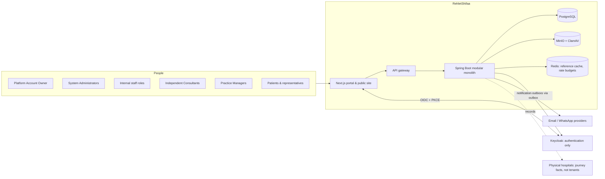

### E2 — Platform Account Owner and System Administrator authority
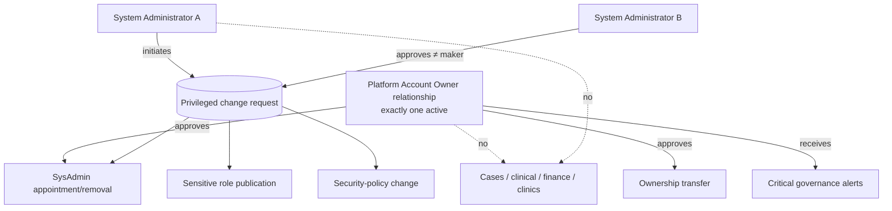

### E3 — Identity and authorization trust boundaries
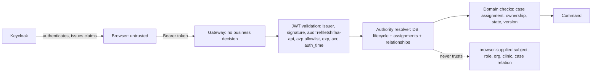

### E4 — Internal staff hierarchy without permission inheritance
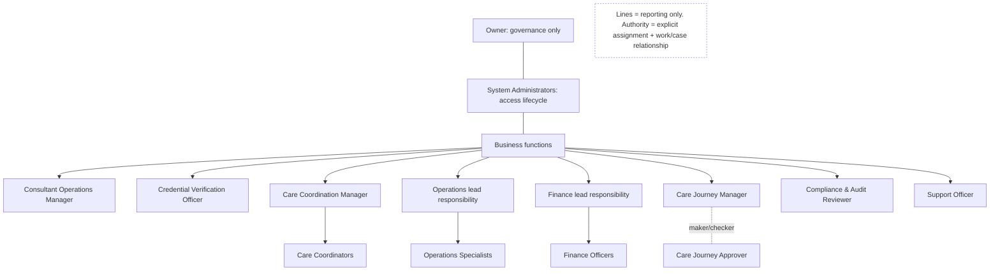

### E5 — Consultant lifecycle
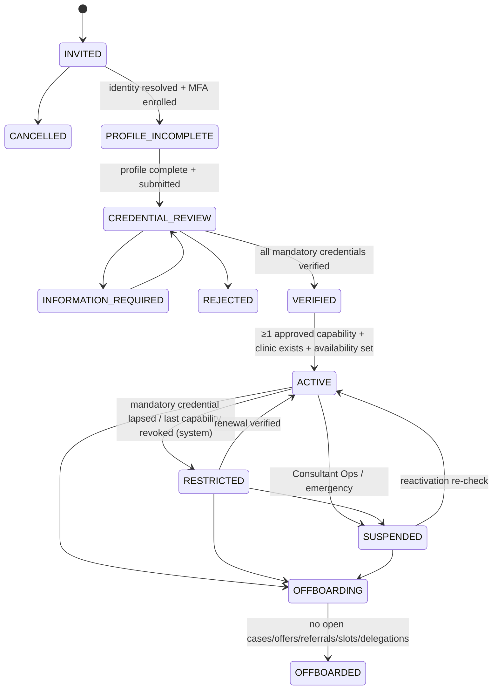

### E6 — Virtual Clinic boundary
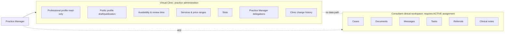

### E7 — Initial assignment offer
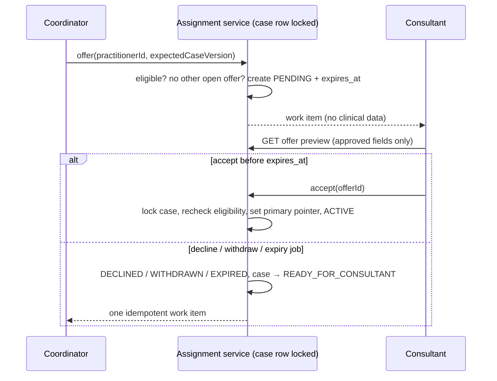

### E8 — Referral / second opinion
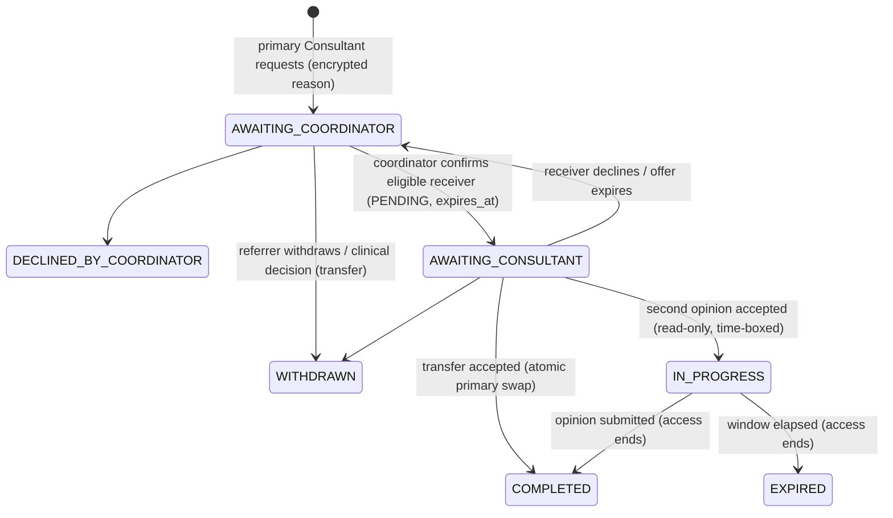

### E9 — Proposal acceptance and Journey activation
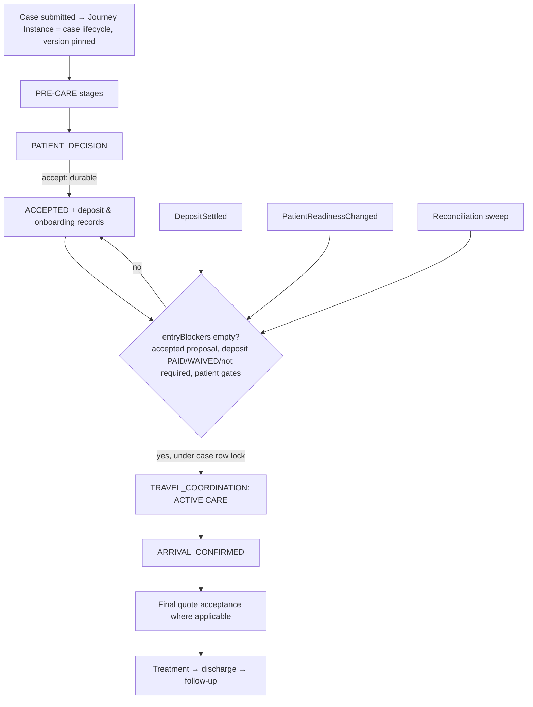

### E10 — Domain and data ownership
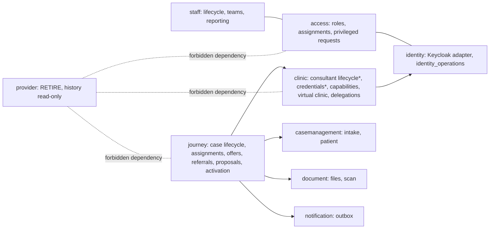
`*` moves from the `practitioner_profiles` columns and provider dossiers into `clinic` ownership (CRD-01).

### E11 — Critical distributed operation (identity outbox)
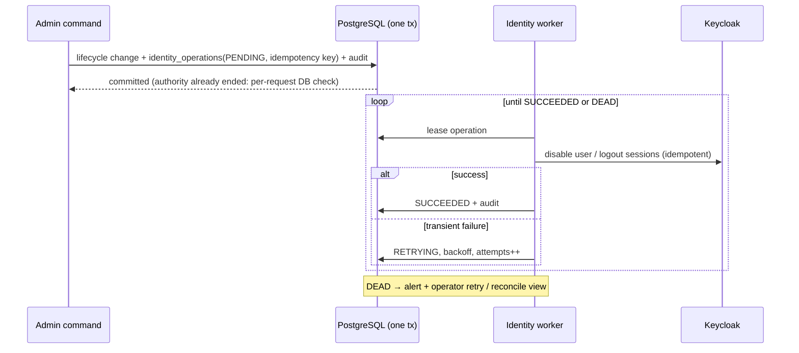

### E12 — Provider-retirement cutover
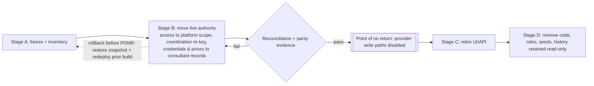

---

## F. Authority matrices

Legend: **X** execute · **A** approve (maker ≠ checker) · **R** read · **R*** read, bounded or metadata only · **—** none.

### F1 — Actor × capability

| Capability | Owner | SysAdmin | ConsOps | CredVer | CoordMgr | Coord | Ops | Fin | JrnMgr | JrnAppr | Auditor | Support | PatIdRev | Consultant | PM | Patient |
|---|---|---|---|---|---|---|---|---|---|---|---|---|---|---|---|---|
| Appoint/remove SysAdmin | A | X/A | — | — | — | — | — | — | — | — | R* | — | — | — | — | — |
| Ownership transfer | A | X (initiate) | — | — | — | — | — | — | — | — | R* | — | — | — | — | — |
| Staff invite/job change/offboard | — | X | — | — | request | — | — | — | — | — | R* | — | — | — | — | — |
| Resend existing invite / login help | — | X | — | — | — | — | — | — | — | — | — | X | — | — | — | — |
| MFA reset | — | X/A | — | — | — | — | — | — | — | — | R* | request | — | — | — | — |
| Consultant invite / lifecycle / suspend | — | — | X | — | — | — | — | — | — | — | R* | — | — | — | — | — |
| Credential decision | — | — | — | X (not own onboardee) | — | — | — | — | — | — | R* | — | — | — | — | — |
| Capability decision | — | — | — | X | — | — | — | — | — | — | R* | — | — | — | — | — |
| Routing policy / teams | — | — | — | — | X | — | — | — | — | — | R* | — | — | — | — | — |
| Offer / assign Consultant | — | — | — | — | X (reassign) | X (owned case) | — | — | — | — | R* | — | — | — | — | — |
| Confirm referral | — | — | — | — | — | X (owned case) | — | — | — | — | R* | — | — | — | — | — |
| Clinical review / decision | — | — | — | — | — | — | — | — | — | — | — | — | — | X (active primary) | — | — |
| Second opinion | — | — | — | — | — | — | — | — | — | — | — | — | — | X (active SO) | — | — |
| Travel / fulfilment | — | — | — | — | — | — | X (assigned) | — | — | — | R* | — | — | — | — | — |
| Deposit / finance gates | — | — | — | — | — | — | — | X (assigned, recent auth) | — | — | R* | — | — | — | — | — |
| Journey draft / publish | — | — | — | — | — | — | — | — | X | A | R* | — | — | — | — | — |
| Patient identity exception | — | — | — | — | — | — | — | — | — | — | R* | — | X | — | — | — |
| Clinic profile/services/slots | — | — | — | — | — | — | — | — | — | — | — | — | — | X/A | X (delegated; approval rules) | — |
| Delegate management | — | — | — | — | — | — | — | — | — | — | — | — | — | X | — | — |
| Proposal decision | — | — | — | — | — | — | — | — | — | — | — | — | — | — | — | X |

### F2 — Actor × data category

| Data | Owner | SysAdmin | Staff (assigned) | Staff (unassigned) | Auditor | Support | Consultant (active primary) | Consultant (pending offer) | Second opinion | PM | Patient/rep |
|---|---|---|---|---|---|---|---|---|---|---|---|
| Identity & account metadata | R* | R | own team R* | — | R* | R* (bounded) | own | own | own | own | own |
| Access assignments & audit | R* | R | — | — | R | — | — | — | — | — | — |
| Case clinical content & documents | — | — | R (role-scoped) | — | audit-case only | — | R/W | **preview only** | R (time-boxed) | — | own case R |
| Referral reasons / opinions | — | — | Coordinator R | — | audit-case only | — | referrer & receiver R | — | own opinion | — | — |
| Proposal & payment evidence | — | — | Coord/Fin R | — | R* | — | R (clinical parts) | — | — | — | own R |
| Credential evidence | — | — | CredVer R | — | R* | — | own | own | own | — | — |
| Virtual Clinic configuration | — | — | ConsOps R | — | R* | — | own R/W | — | — | delegated | published profile only |
| Staff lifecycle / HR-like data | R* | R/W | manager R* | — | R* | — | — | — | — | — | — |

### F3 — Role grant / revoke / approve

| Role / relationship | Initiates | Approves | Constraints |
|---|---|---|---|
| Platform Account Owner | Owner (transfer) or 2 SysAdmins (recovery, OD-02) | Incoming owner accepts; recovery per OD-02 | Exactly one; recent auth; phishing-resistant MFA |
| System Administrator | SysAdmin | Different SysAdmin or Owner | Never self; last-admin guard |
| Compliance & Audit Reviewer | SysAdmin | Different SysAdmin | Conflicts with any mutating role |
| Credential Verification Officer | SysAdmin | Different SysAdmin | Conflicts with Consultant Operations for the same Consultant |
| Other internal roles | SysAdmin (on staffing request) | — (not privileged) | Conflict rules; effective dates |
| Consultant (business role) | Consultant Operations (invite) | Lifecycle gates (CredVer decisions) | Activation invariants |
| Practice Manager delegation | Consultant | Invitee consent | Permissions ⊆ {SCHEDULE, PROFILE, SERVICES} |
| Patient representative | Patient (existing flow) | — | Unchanged |

### F4 — Lifecycle-transition authority

| Transition | Authority | Recent auth | Reason |
|---|---|---|---|
| Staff INVITED→ACTIVE | System (activation with MFA) | — | — |
| Staff ACTIVE⇄SIGNIN_DISABLED | SysAdmin | Yes | Required |
| Staff →OFFBOARDING→OFFBOARDED | SysAdmin (blockers resolved) | Yes | Required |
| Consultant INVITED→…→CREDENTIAL_REVIEW | Consultant + Consultant Ops | — | — |
| CREDENTIAL_REVIEW→VERIFIED/INFO_REQUIRED/REJECTED | Credential Verifier | Yes | Required |
| VERIFIED→ACTIVE | System (invariant check), triggered by Consultant Ops | — | — |
| ACTIVE⇄RESTRICTED | System (credential/capability events); cleared by CredVer decision | — | System |
| →SUSPENDED / reactivation | Consultant Ops; emergency suspension also CredVer | Yes | Required |
| →OFFBOARDING→OFFBOARDED | Consultant Ops | Yes | Required |
| Case ACCEPTED→TRAVEL_COORDINATION | System only (CaseHandoffService) | — | Gate evidence |
| Offer PENDING→ACTIVE/DECLINED | Offered Consultant | Accept: no (not a clinical act) | Decline reason optional |
| Offer →WITHDRAWN / EXPIRED | Owning Coordinator / system | — | — |

### F5 — Case-access matrix

| Relationship to case | Workspace | Documents | Messages / tasks | Clinical write | Duration |
|---|---|---|---|---|---|
| Owning Coordinator (ACTIVE) | R | R | R/W (threads) | — | While owned |
| Consultant ACTIVE primary, eligible | R | R | R/W | W | Until ended |
| Consultant ACTIVE primary, RESTRICTED/SUSPENDED (licence) | R (handover) | R | R | **—** | Until reassigned or OD-05 window |
| Consultant PENDING offer / referral offer | **—** | **—** | — | — | Preview only |
| Second opinion ACTIVE | R | R | — | submit opinion only | Until submitted or expiry |
| Ended / declined / expired assignment | — | — | — | — | — |
| Ops / Finance ACTIVE assignment | R (role-scoped) | R (role-scoped) | own thread | own domain | While assigned |
| Practice Manager, SysAdmin, Owner, Support | — | — | — | — | Never |
| Auditor | Metadata; content via audit case | Via audit case | — | — | Audit case expiry |

### F6 — Audit visibility matrix

| Audit stream | Owner | SysAdmin | Auditor | Consultant | PM | Patient |
|---|---|---|---|---|---|---|
| Governance / privileged changes | R | R | R | — | — | — |
| Access decisions & denials | — | R | R | — | — | — |
| Staff lifecycle | — | R | R | — | — | — |
| Consultant lifecycle / credential / capability | — | — | R | own summary | — | — |
| Virtual Clinic change history | — | — | R | own clinic | delegated clinic (entries within own permissions) | — |
| Case / Journey history | — | — | R (content via audit case) | assigned cases | — | own case (patient-facing view) |
| Identity-operation log | — | R | R | — | — | — |

---

## G. Invariant catalogue

Written as testable predicates. The canonical revision carries the same list (§3.1).

| ID | Invariant | Enforcement | Test |
|---|---|---|---|
| INV-01 | Exactly one active Platform Account Owner relationship exists after bootstrap | Governance table + transfer command under governance lock | Transfer; concurrent transfer; ending without successor → 409 |
| INV-02 | The owner relationship cannot end without an accepted successor or completed recovery | Command guard | End last owner → 409 `LAST_OWNER` |
| INV-03 | At least one effective System Administrator (ACTIVE lifecycle, effective assignment, MFA enrolled) exists | Guard on revoke/disable/offboard/expiry | Revoke last → 409 `LAST_ADMINISTRATOR`; the scheduled-expiry job refuses too |
| INV-04 | No actor grants, revokes, approves, verifies or publishes anything whose subject or maker is themselves | Service guard + privileged request maker ≠ checker | Self-grant/approve → 403 |
| INV-05 | The Credential Verifier for Consultant X is not X's Consultant Operations owner | Relationship check | Conflict → 403 `CONFLICT_OF_DUTY` |
| INV-06 | Every Consultant has exactly one Virtual Clinic from creation | Same-transaction creation + PK = practitioner_id | Create Consultant → clinic row exists without UI access |
| INV-07 | ACTIVE ⇒ every mandatory credential requirement satisfied and current | Lifecycle guard + expiry job | Lapse → RESTRICTED within one scan |
| INV-08 | Assignment eligibility ⇒ ACTIVE ∧ approved CARE_AREA capability for the case area ∧ AVAILABLE ∧ account enabled ∧ no blocker | Single eligibility rule | Profile area only → ineligible |
| INV-09 | At most one open initial offer per case | Case-row lock + check | Parallel offers → one succeeds |
| INV-10 | Every open offer has `expires_at` in the future; past expiry it grants nothing even before the job runs | Read-time check + job | Accept at t ≥ expires_at → 409 |
| INV-11 | Exactly one ACTIVE primary Consultant per case in any state from `CONSULTANT_REVIEW` onward, and none before the first acceptance | `case_primary_consultant` PK + lock | Concurrency tests (F-05, F-06) |
| INV-12 | PENDING, DECLINED, WITHDRAWN, EXPIRED and ENDED assignments grant no case, document, message or timeline access | `authorizeRead` | Matrix test |
| INV-13 | Referral assignments never satisfy a primary-assignment check | `requireActiveAssignment` | Existing tests (CONFIRMED) |
| INV-14 | A second-opinion assignment is read-only and ends on submission or expiry | Guard + job | Existing test + expiry test |
| INV-15 | Practice Manager delegations grant no access outside `/api/v1/clinics/{own delegated id}` | No case/document path accepts delegation | Existing test (CONFIRMED) + patient endpoints |
| INV-16 | A delegation grants nothing until accepted with MFA; widening grants nothing until re-accepted | State machine | Invited → 403 |
| INV-17 | One Journey Instance (case lifecycle record) per admitted case; version pin immutable | Unique case binding (V40/V48) | Duplicate admission → no-op |
| INV-18 | `ACCEPTED → TRAVEL_COORDINATION` only when `entryBlockers` is empty; idempotent | CaseHandoffService (CONFIRMED) | Duplicate events → one transition |
| INV-19 | Proposal acceptance is never rolled back by later activation failure | Separate transactions | Deposit creation failure → still ACCEPTED + repair work |
| INV-20 | No authorization decision reads organization, membership, facility or provider-role data | ArchUnit + query inventory | Architecture test |
| INV-21 | Revoking a DB assignment or disabling a lifecycle removes authority on the next request, regardless of realm roles or token lifetime | Authority resolver | Test F-10 |
| INV-22 | No administrator, owner, auditor, support user, manager or Practice Manager passes a clinical authorization check by role alone | Negative tests | Matrix test |
| INV-23 | Every high-risk command commits its audit record in the same transaction or does not commit | Same-transaction audit | Audit insert failure → command rolled back |
| INV-24 | Audit and history rows are never updated or deleted by the application | DB privileges (production) | Attempted UPDATE → permission denied |
| INV-25 | Clinical write actions require a current eligible primary assignment (not RESTRICTED or SUSPENDED for licence reasons) | Guard | F-08 test |

---

## H. Failure and concurrency analysis

| # | Scenario | Authoritative state | Expected / allowed / denied | Retry & reconciliation | Audit evidence | Operator action | Acceptance test |
|---|---|---|---|---|---|---|---|
| 1 | Owner unavailable | Owner relationship (DB) | Platform keeps operating. Owner-approval commands pend; SysAdmin appointment can still be approved by a second SysAdmin | Recovery per OD-02 | `OWNER_RECOVERY_*` | Execute OD-02 procedure | Recovery with cooling-off; notifications sent |
| 2 | Last SysAdmin resigns or is disabled | Assignments + lifecycle | Denied: 409 `LAST_ADMINISTRATOR`, including expiry-driven | Scheduled expiry refuses and alerts the Owner | Denial audited | Appoint successor first | INV-03 test |
| 3 | Admin A requests own privilege increase | Privileged request | Denied at request creation (subject = maker) | — | `SELF_GRANT_DENIED` | — | INV-04 test |
| 4 | Keycloak succeeds, DB fails | DB | Cannot happen for new ops: identity calls run only after commit (IDO-01). For creation, the operation marker lets `recover` adopt or delete the orphan | Reconciliation job lists unknown Keycloak users with markers | `IDENTITY_ORPHAN_RECONCILED` | Approve adopt/delete | Fault-injection test |
| 5 | DB commits, Keycloak/session revocation fails | DB | Authority already ended (per-request DB check). Sessions may live until token expiry (≤ 5 min) | Outbox retries with backoff; DEAD after N → alert | Operation rows + audit | Retry from console | Keycloak 503 test |
| 6 | Credentials expire with active cases | Credential requirement evaluation | RESTRICTED: no new offers; pending offers withdrawn; clinical writes blocked; read for handover | Hourly scan + event; idempotent | `CONSULTANT_RESTRICTED` | Coordinator reassigns (urgent item) | F-08 test |
| 7 | Capability revoked during active care | Capability decisions | New eligibility for that area ends. Active cases continue unless the revocation is flagged `IMMEDIATE` (OD-05) | — | `CAPABILITY_REVOKED` with scope | Clinical governance review | Both variants tested |
| 8 | Suspended while offer pending | Lifecycle | Offer auto-withdrawn in the suspension transaction; acceptance denied by eligibility recheck | — | `OFFER_WITHDRAWN(reason=SUSPENDED)` | Coordinator re-offers | Test |
| 9 | Two Coordinators compete for offers | Case row + ownership | Only the owning Coordinator can offer; parallel requests serialize, second gets 409 `OFFER_ALREADY_OPEN` | Client retries with fresh version | Both attempts audited | — | Parallel test |
| 10 | Accept exactly at expiry | `expires_at` vs DB clock | Accepted iff `now < expires_at` inside the locked tx; otherwise 409 `OFFER_EXPIRED` | Expiry job idempotent | Decision audited | — | Boundary test with fixed clock |
| 11 | Referral acceptance races final decision | Case row lock | Serialized; exactly one outcome (F-05) | — | Both audited | — | Concurrency test |
| 12 | PM revoked while editing | Delegation row | Next command 403. In-flight prepared change stays `PENDING_APPROVAL` for the Consultant to decide; version guard prevents stale apply | — | `CLINIC_MANAGER_REVOKED` | — | Test |
| 13 | Proposal accepted, deposit creation fails | Proposal decision (committed) | Acceptance stands (INV-19). Deposit creation retried by repair job | Sweep: ACCEPTED without deposit record → create | `DEPOSIT_REPAIR` | Finance notified if repair fails | Fault-injection test |
| 14 | Deposit settles before patient ready | Payment + readiness | Stays ACCEPTED; transition on readiness event or sweep | Sweep (OPS-05) | Status history | — | Existing handoff tests |
| 15 | Duplicate readiness events | Case status guard | One transition (CONFIRMED guarded update) | — | One history row | — | Existing + duplicate-event test |
| 16 | Provider retirement leaves an org-scoped grant or credential | Reconciliation report | Cutover blocked until zero live org-scoped grants; provider credentials grant no eligibility | RET reconciliation queries | Report stored | Resolve each item | RET-06 test |
| 17 | Redis unavailable | DB | Cache falls back to DB (CONFIRMED `CacheConfig`); rate limiter degrades per policy; no authorization state in Redis | — | Metric | Restore Redis | Chaos test |
| 18 | MinIO or scanning unavailable | Document records | Uploads fail visibly; unscanned documents never downloadable; case progress unaffected | Scan retries | Scan status | Restore service | Existing scan tests + outage test |
| 19 | Notification delivery keeps failing | Notification outbox | Business state unaffected; DEAD after max attempts; in-app work items still present | Outbox retries (CONFIRMED) | Outbox rows | Dead-letter review; alternative contact | Test |
| 20 | Audit write fails during a high-risk command | DB transaction | Command rolls back (INV-23) | Client retry | None (nothing happened) | Investigate DB | Fault-injection test |
| 21 | Restore produces stale identity/access state | DB restore point vs Keycloak | After restore, block workforce sign-in until reconciliation passes: re-apply identity operations recorded after the restore point from the export log; disable identities whose DB lifecycle is not ACTIVE | Reconciliation job | Restore report | Run restore runbook | Restore drill |
| 22 | Returning user already has another identity relationship | Server-side identity resolution | Exact verified-email match to one identity → adopt with consent; ambiguity → `IDENTITY_REVIEW` (fail closed); never link on a browser assertion | Patient Identity Reviewer / SysAdmin | Resolution audit | Resolve | Existing patient-identity tests + staff/PM cases |

**Missing recovery operations (now required, OPS-07):** retry/abandon identity operation; re-send/expire offer;
force-withdraw stuck referral; re-run activation handoff for one case; reconcile Keycloak vs DB lifecycle; replay
dead-lettered notification; restore-drill checklist; audit export.

---

## I. Provider-retirement closure report

### Remaining organization/provider dependencies affecting live authority or routing

| Dependency | Where | Effect today | Disposition |
|---|---|---|---|
| `access_memberships(subject, organization_id)` required by every `role_assignments` and `resource_relationships` row | V31, `RoleAssignmentRepository`, `AuthorizationService.evaluate` (`activeMember`, `organizationVerified`) | Every DB authorization decision checks membership | Replace with platform-scope subjects; drop the membership check (ACG-01..ACG-05) |
| `ORGANIZATION`, `ASSIGNED_ORGANIZATIONS`, `MANAGED_CLINICIANS` scopes | V31 check constraint, `scopeMatches` | Org-wide grants | Retire; reconcile assignments |
| `ProviderOrganizationAuthorityPort` | `RoleAssignmentService`, `AccessQueryService` | Org verification in grants and explanations | Remove |
| Coordination teams, capacity, policies, preferences, decisions, case routing keyed by `organization_id` | `CoordinationRepository`, `CoordinationReadService`, V36 | Routing scope | Re-key to platform (RET-03) |
| `AssignmentEngine.guardLegacyWrite` (LIVE org routing blocks legacy writes) | coordination | Blocks claim/reassign for bound cases | Keep the guard semantics under platform scope |
| `ProviderCredentialEligibility.adopted/requireLegacyWriteAllowed` | `ConsultantEligibilityService`, `JourneyService` | Adopted consultants fail closed; legacy writes blocked | Migrate dossiers → direct credentials, then remove |
| `clinician_onboardings.credential_policy_cutover_at`, `reconcileProviderCredentials` | `CredentialExpiryService` | Expiry split across two authorities | Single expiry job on direct records |
| `ProviderPricingCatalogPort` | `PricingCatalogService` | Price source bridge | Point estimates at the clinic catalogue only |
| `CoordinationReadinessAdapter` | coordination → provider | Readiness facts | Replace with clinic lifecycle facts |
| Routes `/api/v1/admin/providers/**`, `/api/v1/provider-workspace/**` | `SecurityConfig` | Reachable | Retire (Stage C) |
| Provider realm roles / role templates / `PROVIDER_OPERATIONS_MANAGER` | V31/V51, realm | Parallel authority | Reconcile, then retire |

### Data to migrate
Direct credential records from provider dossiers (evidence, decisions, expiry, source IDs); legitimate prices,
services, availability and schedules to the Virtual Clinic; coordination teams, policies and preferences re-keyed;
role assignments converted to platform scope; Consultant Operations ownership relationships.

### Data to preserve (read-only history, no authority)
Provider organizations, memberships, dossiers, revisions, provider domain events, role-template versions, access
audit, coordination decisions. Retained under DAT-05 until OD-01 retention rules are set.

### Code, UI, API and configuration to retire
`/{locale}/portal/practice`, Provider Workspace components and hooks, Control Center provider sections,
`/api/v1/provider-workspace/**`, `/api/v1/admin/providers/**`, org-specific coordination APIs, provider invitations,
org scopes, provider notification templates (`PROVIDER_CREDENTIAL`), seeds, feature flags, translations, and the
`provider` module application code once ArchUnit and a runtime inventory show zero inbound use.

### Reconciliation evidence (RET-06)
Counts before and after per migrated table; the eligibility outcome of every Consultant under the old and new rules,
with every difference explained; zero live assignments with a non-platform organization; zero queries from live
endpoints or jobs into provider tables (SQL inventory + ArchUnit); price parity per active service; the
regression suite green.

### Cutover prerequisites
Phases 1–7 complete; OD-03 decided (the credential set is needed to migrate dossiers meaningfully); reconciliation
report signed off by the Consultant Operations and Credential Verification leads.

### Rollback boundary
Before the point of no return: restore the pre-cutover database snapshot and redeploy the previous build (no
production customers). After the point of no return (provider write paths disabled): roll forward only.

### Final deletion exclusions
No physical deletion of any history, audit, credential evidence, case, payment or clinical data as part of
retirement (RET-11). Physical deletion needs a separate retention decision under OD-01.

---

## J. Open decisions

Only decisions requiring business, clinical-governance, privacy or legal authority are listed.

| ID | Decision | Owner | Recommended option | Alternatives | Risks | Gate | Fail-safe default until decided |
|---|---|---|---|---|---|---|---|
| OD-01 | Operating jurisdictions, controller/processor roles, data residency, cross-border transfer, retention, breach notification, patient rights | Legal counsel + DPO + CEO | Obtain an opinion covering UAE federal law (Federal Law 2/2019 + Cabinet Res. 32/2020, PDPL 45/2021 and its interplay with health data), the relevant emirate health authority, Egypt Law 151/2020, and GDPR/HIPAA triggers only if EU/US exposure exists; single hosting region chosen by counsel | Per-market deployments; contractual-only approach | Unlawful processing or transfer; wrong retention | **Production launch** | Single region; no replication outside it; no deletion of any record; no marketing use of health data |
| OD-02 | Owner recovery and transfer procedure | Owner / board + Legal | Named successor on file. Recovery started by two System Administrators, confirmed by a board resolution and out-of-band identity verification, 72 h cooling-off, notification to all administrators and the outgoing owner | Escrow with a law firm; vendor-assisted | Hostile takeover by colluding admins; lock-out | Phase 3 (owner relationship) | Owner-only commands unavailable; platform runs under SysAdmins |
| OD-03 | Mandatory credential requirement set per professional type and jurisdiction | Medical director / credentialing lead | Launch set: government identity document; current licence/registration valid for the jurisdiction where advice or treatment occurs; specialist qualification/board certification for the claimed specialty; professional indemnity where the jurisdiction requires it | Add CV/references; per-hospital privileges | Unqualified clinicians | Phase 5 (Consultant lifecycle) | No new Consultant becomes ACTIVE; existing test Consultants stay non-production |
| OD-04 | Pre-acceptance offer preview dataset | DPO + medical director | Care area, requested capability, review type, urgency, SLA/expiry, age band (child/adult/older adult), sex only if clinically relevant, preferred language, a Coordinator-authored clinical question (no patient free text), number and type of documents (no content). Excludes name, DOB, contacts, nationality, identity numbers, exact location, patient-authored text, documents | Fully de-identified abstract; full case after NDA-style attestation | Over-disclosure vs. uninformed acceptance | Phase 6 (offers) | Care area, capability, review type, urgency, SLA only |
| OD-05 | Clinical continuity when eligibility is lost | Medical director / clinical governance | Licence lapse or suspension: clinical writes blocked immediately; read-only handover until reassignment is accepted, max 72 h; urgent Coordinator item within 4 business hours. Capability revocation: new work only, unless flagged `IMMEDIATE` (then treated as suspension for that area) | Grace period for administrative lapses | Unlicensed clinical acts vs. abandoned patients | Phase 5 | Immediate block of clinical writes; read-only handover; no time limit on handover read until reassignment |
| OD-06 | RTO, RPO, availability SLO, support hours | CEO / operations lead | RPO ≤ 15 min (PITR), RTO ≤ 4 h, 99.5 % monthly for patient and staff APIs, quarterly restore drill | Tighter with a warm standby | Data loss, prolonged outage | **Production launch** | Daily backups + PITR enabled; restore drill before launch |
| OD-09 | Supervisory case visibility depth and content | Head of operations + DPO | Team leads: cases actively assigned to their team members, same data scope as the member's role, audited. Higher managers: workload and summaries only | Transitive subtree read (current); summary-only for everyone | Over-exposure of health data vs. ineffective supervision | Phase 2A visibility rules | Direct team members only, same scope, audited |
| OD-07 | Practice Manager `APPOINTMENT_ADMIN` (deferred) | Product + DPO | Keep deferred; contract per PM-11 if revisited | — | Clinical leakage | Future release | No patient/case access |
| OD-08 | Booking hold, cancellation window, proxy booking (deferred) | Product | Decide with the booking release | — | — | Booking release | Booking disabled |

---

## K. Canonical document revision

Delivered as revision 2 of `platform-users-and-virtual-clinics-requirements.md` (same path). It preserves all valid
content and the IMPLEMENTED / REMAINING / RETIRE / DEFERRED labels, adds requirement IDs, corrects the baseline
claims (F-01..F-07, F-13, F-14), and adds §3 (cross-cutting requirements and invariants) and §4 (open decisions).
No frozen decision was changed.

---

## L. Traceability and acceptance matrix

| Business decision | Architecture requirements | Domain owner | API / service boundary | Data owner | Security control | Test / acceptance evidence | Operational control | Standard |
|---|---|---|---|---|---|---|---|---|
| D-01 One platform scope | ACG-01..ACG-05, INV-20 | access | `AuthorizationService` | access | No org input accepted | ArchUnit + org-param rejection tests | Reconciliation report | ISO/IEC 27002 access control |
| D-02 Provider constructs retired | RET-01..RET-12 | platform architecture | Provider APIs removed | provider (history) | No provider authority | RET-06 evidence | Cutover checklist | 42010 decision record |
| D-03 Hospitals are facts, not tenants | LOC-01 | journey | Journey/proposal APIs | journey | No location-based access | Negative test: location never scopes access | — | — |
| D-04 Consultants independent | CNS-01, ELG-01 | clinic | Eligibility service | clinic | No org provenance | Eligibility tests | — | — |
| D-05 One Virtual Clinic per Consultant | VC-01, VC-02, INV-06 | clinic | Consultant creation workflow | clinic | PK = practitioner_id | Creation test | Nightly integrity check | 25010 integrity |
| D-06 Clinic is not clinical | VC-04, VC-05, INV-15 | clinic | `/api/v1/clinics/**` | clinic | No case joins in clinic module | ArchUnit + PM isolation tests | — | ISO 27799 |
| D-07 Case access from active assignment | ASG-05, INV-11..INV-13 | journey | `authorizeRead`, `requireActiveAssignment` | journey | Server-side relationship check | Access matrix tests | Access-denial metrics | API1:2023 |
| D-08 PM explicit delegates | PM-01..PM-08 | clinic | Clinic delegation API | clinic | Consent + MFA | Delegation tests | Delegation review | 800-63A-4 |
| D-09 PM no clinical access | PM-09, INV-15 | clinic/journey | Case APIs reject delegation | journey | No path | Negative tests | — | Minimum necessary |
| D-10 Owner is a relationship | GOV-01..GOV-08, INV-01, INV-02 | access | Governance commands | access | Recent auth + phishing-resistant MFA | Governance tests | Owner alerts | 27002 privileged access |
| D-11 SysAdmin sole default admin role | ROLE-01, ACG-11 | access | Access governance API | access | No business bypass | Negative bypass tests | Quarterly review | 27002 |
| D-12 Two SysAdmins recommended | GOV-04, INV-03 | access | Privileged requests | access | Maker ≠ checker | Last-admin tests | Admin-count alert | 27002 |
| D-11/D-12/D-13 Workforce roles and hierarchy | WF-01..WF-17, ROLE-02, STF-11, INV-26..INV-29 | workforce | Workforce module: people, teams, reporting, lead designations | workforce | Lead actions scoped to own teams; function managers edit teams, SysAdmins grant roles | Phase 2A tests (F-38..F-47) | Reconciliation report WF-16; recertification | ISO/IEC 27002 SoD |
| D-14 Credential ≠ capability | CRD-01..CRD-08, CAP-01..CAP-06 | clinic | Separate commands and tables | clinic | Distinct decisions, reasons | Distinct-record tests | Expiry job monitoring | ISO 27799 |
| D-15 Assignment needs approved capability | ELG-01, INV-08 | clinic | Eligibility service | clinic | Single rule | Eligibility tests | — | Patient safety |
| D-16 Profile area grants nothing | ELG-02 | clinic | Eligibility service | clinic | — | Negative test | — | Patient safety |
| D-17 One Journey Instance | JRN-01..JRN-06, INV-17..INV-19 | journey | `CaseTransitionPolicy`, `CaseHandoffService` | journey | System-only activation | Activation tests | Handoff sweep + alert | 25010 |
| D-18 Keycloak authenticates, platform authorizes | IAM-01..IAM-12, INV-21 | access/identity | JWT validator + authority resolver | access | aud/acr/auth_time checks | Revocation tests | Identity-op monitoring | 800-207, RFC 9700 |
| D-19 No regression | Regression suite gates in §2.17 | all | — | — | — | Full backend + e2e suites | Release checklist | 25010 |
| D-20 Pre-production retirement | RET-07, RET-12 | platform architecture | — | — | — | Cutover evidence | Point-of-no-return record | ISO 31000 |

---

## M. Final closure statement

CANONICAL REQUIREMENTS DOCUMENT:
CONSISTENT

PLATFORM ARCHITECTURE:
CONDITIONALLY CLOSED

SECURITY AND IAM ARCHITECTURE:
CONDITIONALLY CLOSED

HEALTHCARE AND PATIENT-SAFETY ARCHITECTURE:
CONDITIONALLY CLOSED

PROVIDER RETIREMENT PLAN:
CONDITIONALLY CLOSED

READY FOR IMPLEMENTATION:
YES

Evidence justifying YES (implementation of the sequenced programme, **not** production launch):

1. Every BLOCKER and HIGH finding (F-01..F-14) has an unambiguous, testable requirement in revision 2. None
   depends on an unmade decision except the parameters in OD-03 and OD-05, which have fail-safe defaults and gate
   only Phase 5.
2. Phase 0 (correct the unsafe V53 behaviour before commit) can start immediately and needs no decision.
3. The activation boundary (`ACCEPTED → TRAVEL_COORDINATION`) is already implemented to the required semantics
   (`CaseHandoffService`, `CaseTransitionPolicy.entryBlockers`) — CONFIRMED.
4. Each open decision OD-01..OD-06 has a named owner, a recommended option, a fail-safe default and a phase gate. No
   phase that depends on a decision can start before its gate.

Conditions that keep the verdicts at CONDITIONALLY CLOSED: OD-01 and OD-06 must be decided before production
launch; OD-02 before Phase 3's owner relationship; OD-03 and OD-05 before Phase 5; OD-04 before Phase 6. The
V53 slice must not be committed as "implemented" or enabled in any shared environment until Phase 0 acceptance
passes.

---

### Sources (standards editions verified 2026-09-26)
- [ISO 27789:2021](https://www.iso.org/standard/75313.html) · [ISO/CD 27789 (revision in progress)](https://www.iso.org/standard/92409.html)
- [ISO 27799:2025](https://www.iso.org/standard/84647.html)
- [ISO/IEC 27701:2025](https://www.iso.org/standard/27701)
- [ISO/IEC 27001:2022/Amd 1:2024](https://www.iso.org/standard/88435.html)
- [NIST SP 800-63-4 (final)](https://csrc.nist.gov/pubs/sp/800/63/4/final)
- [NIST SP 800-218 v1.1 (final)](https://csrc.nist.gov/pubs/sp/800/218/final) · [SP 800-218r1 IPD (draft)](https://csrc.nist.gov/pubs/sp/800/218/r1/ipd)
- [OWASP ASVS 5.0.0](https://github.com/OWASP/ASVS/tree/v5.0.0)
- [OWASP API Security Top 10 2023](https://owasp.org/API-Security/editions/2023/en/0x11-t10/)
- [OWASP Top 10:2025](https://owasp.org/Top10/2025/)
- [FHIR specification directory](https://hl7.org/fhir/directory.html) · [FHIR 6.0.0-ballot5](https://hl7.org/fhir/6.0.0-ballot5/versions.html)
- [IEC 62304:2006+AMD1:2015](https://webstore.iec.ch/en/publication/22794) · [IEC 62304 Ed. 2 design specification (in development)](https://assets.iec.ch/public/sc62a/IEC%2062304%20Ed.%202.0%20Design%20Specification.pdf)
- [UAE Federal Law No. 2 of 2019](https://uaelegislation.gov.ae/en/legislations/1209) · [MoHAP summary](https://mohap.gov.ae/en/w/federal-law-no.-2-of-2019-concerning-the-use-of-information-and-communication-technology-ict-in-health-fields) · [UAE data protection laws](https://u.ae/en/about-the-uae/digital-uae/data/data-protection-laws)
