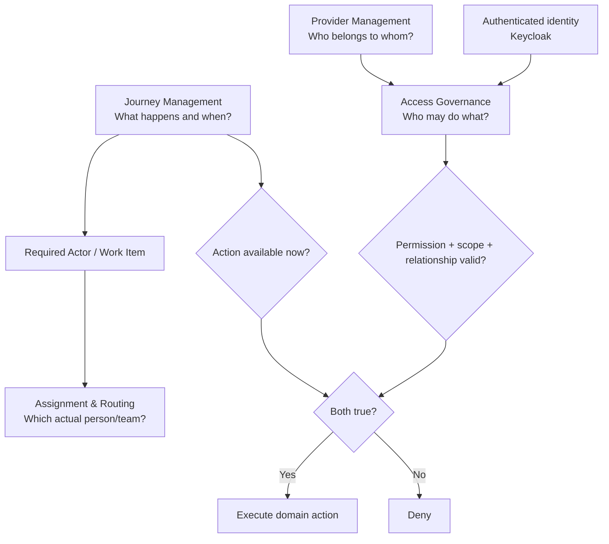
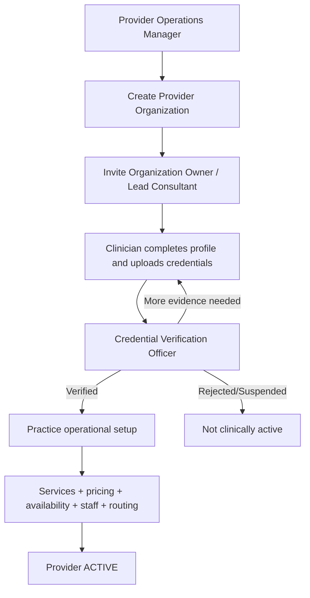
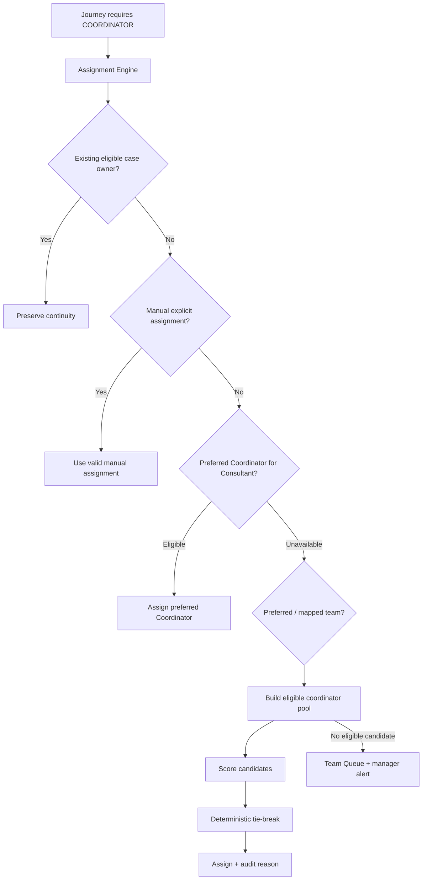

# RehletShifaa Platform Control Plane — Final Business & Technical Blueprint

**Status:** Final recommended architecture for implementation  
**Version:** 1.0  
**Date:** September 2026  
**Product:** RehletShifaa commercial healthcare SaaS

---

## 1. Executive decision

RehletShifaa should not be designed around hardcoded staff roles, doctor-specific workflows, or one large `Admin` role. The commercial platform should be built around four separate but cooperating control planes:

1. **Access Governance — who may do what.**
2. **Provider Management — who belongs to which provider organization, who supervises/manages whom, and whether clinicians are verified/active.**
3. **Journey Management — what happens next, in what order, under which conditions, and which abstract actor is responsible.**
4. **Work Assignment & Routing — which actual person or team receives the work when the journey requires an actor.**

The implementation must preserve this separation. A user is allowed to execute a sensitive business action only when both access governance and the active journey allow it.



### Product rule to freeze

> **Roles determine WHO may participate. Journey Management determines WHAT happens and WHEN. Provider Management determines WHO BELONGS TO WHOM. Assignment Management determines WHICH ACTUAL PERSON receives the work. Domain services determine HOW the business action is safely executed.**

This model is the backbone for future Consultant mobile, practice scheduling, video consultation, appointment/reservation modules, additional care journeys, and enterprise provider onboarding.

---

## 2. Product operating model

RehletShifaa is the SaaS platform owner. Customer/provider organizations can be solo practices, physician groups, clinics, hospitals, or future provider networks.

A **Consultant is not a tenant**. The tenant is a **Provider Organization**.

Examples:

```text
RehletShifaa SaaS
│
├── Provider Organization: Dr Ahmed Cardiology Practice
│   ├── Organization Owner: Dr Ahmed
│   ├── Consultant: Dr Ahmed
│   ├── Associate Doctor: Dr Ali
│   ├── Practice Manager: Sara
│   └── Consultant Assistant: Mona
│
└── Provider Organization: ABC Medical Group
    ├── Organization Owner: Clinic Executive
    ├── Consultants: Dr X, Dr Y, Dr Z
    ├── Associate Doctors
    ├── Practice Managers
    └── Consultant Assistants
```

One user may hold multiple scoped responsibilities. For example, a solo doctor may be both **Organization Owner** and **Consultant**. Permissions must remain separate internally even when held by one person.

---

# PART A — BUSINESS ROLES

## 3. Final business-friendly default role catalogue

These are **default role templates**, not immutable code roles. Underneath, access is granted through registered capabilities, scope, relationships, and workflow context.

### 3.1 RehletShifaa platform governance roles

| Business role | Recommended system key | Business meaning | Important boundary |
|---|---|---|---|
| **RehletShifaa Owner** | `PLATFORM_OWNER` | Business owner/governance authority for the SaaS. Delegates administrators and approves platform governance. | Does not automatically receive unrestricted patient/clinical access. |
| **Access Governance Manager** | `ACCESS_GOVERNANCE_MANAGER` | Configures role templates, permission bundles, scopes, conflicts, and access policies. | Cannot invent executable capabilities that engineering has not registered. |
| **System Administrator** | `PLATFORM_ADMIN` | Technical administration: identity support, integrations, technical tenant settings, operational platform configuration. | Technical admin does not automatically mean clinical, finance, journey-publish, or credential authority. |
| **Provider Operations Manager** | `PROVIDER_OPERATIONS_MANAGER` | RehletShifaa employee responsible for onboarding provider organizations and getting them operationally ready. | Scoped to assigned provider organizations; cannot self-verify clinician credentials or publish journeys by default. |
| **Credential Verification Officer** | `CREDENTIAL_VERIFIER` | Verifies licensed clinicians, identity, licenses, qualifications, evidence, and expiries. | Cannot verify own credentials or perform final clinical actions because of this role. |
| **Journey Manager** | `JOURNEY_MANAGER` | Designs and maintains RehletShifaa's platform-wide care journeys using supported stage capabilities. | Can edit drafts, validate, and simulate; publishing is separate when maker/checker is required. |
| **Journey Approver** | `JOURNEY_APPROVER` | Reviews, approves, publishes, and retires journey versions. | Should be separated from Journey Manager for high-risk production changes. |
| **Care Coordination Manager** | `CARE_COORDINATION_MANAGER` | Manages Coordinator teams, routing policies, capacity, assignment exceptions, and escalations. | Does not acquire clinical authority simply because they control routing. |
| **Compliance & Audit Reviewer** | `COMPLIANCE_AUDITOR` | Read-only governance/audit access to authorization, credentialing, journey versions, assignment decisions, and approved audit data. | No operational mutation. |
| **Support Officer** | `SUPPORT_AGENT` | Helps with account invitations, login problems, and controlled technical support. | No silent impersonation or broad clinical export. |

### 3.2 Provider-organization roles

| Business role | Recommended system key | Business meaning | Important boundary |
|---|---|---|---|
| **Organization Owner** | `ORGANIZATION_OWNER` | Commercial/account owner of the provider organization. Appoints permitted organization managers and controls organization membership. | Not automatically a clinician. |
| **Practice Manager** | `PRACTICE_MANAGER` | The merged practice administrator/secretary/scheduler role. Manages practice operations, availability, slots, appointments, service catalogue, price lists, and permitted practice staff. | No final clinical recommendation, credential verification, or financial settlement authority by default. |
| **Consultant / Doctor** | `CONSULTANT` | Senior/final clinical authority for assigned cases. Accepts/declines work, reviews evidence, and submits final clinical recommendations within configured governance. | No platform administration by default. |
| **Associate Doctor** | `ASSOCIATE_DOCTOR` | A licensed doctor working under configured Consultant/supervisory relationships. May perform explicitly delegated clinical tasks. | Must be credential-verified independently; does not automatically inherit final Consultant authority. |
| **Consultant Assistant** | `CONSULTANT_ASSISTANT` | Delegated support linked to one or more Consultants. May perform permitted administrative/support tasks and possibly prepare drafts. | Cannot silently become the Consultant or finalize clinical authority. |

### 3.3 Care-journey operational roles

| Business role | Recommended system key | Business meaning | Important boundary |
|---|---|---|---|
| **Care Coordinator** | `COORDINATOR` | Owns patient relationship/case coordination, missing information, Consultant assignment, and proposal coordination. | Not final clinical authority and not financial settlement authority. |
| **Operations Specialist** | `OPERATIONS` | Fulfilment role: appointment coordination, hospitals, travel, visa support, accommodation, transfers, and later reservations. | No clinical authority. |
| **Finance Officer** | `FINANCE` | Controls deposit/payment confirmation, reconciliation, authorized waiver/refund, and finance gates. | Price-list maintenance is provider/practice responsibility, not settlement responsibility. |

### 3.4 Non-human actor

| Business role | Recommended system key | Business meaning |
|---|---|---|
| **Integration Service Account** | `SERVICE_ACCOUNT` | Non-human identity with narrow API scopes for approved integrations/background workers. Never model as a human Admin. |

Patients and representatives are application actors. A representative relationship should be modeled as explicit delegation to a patient, not as a generic staff role.

---

## 4. Who onboards whom — final responsibility model

### 4.1 Provider organization onboarding

The **Provider Operations Manager** is the RehletShifaa owner of provider onboarding.



Creating/inviting a clinician and verifying/activating a clinician are deliberately different authorities.

### 4.2 Clinician onboarding lifecycle

Recommended lifecycle:

`INVITED → PROFILE_INCOMPLETE → DOCUMENTS_SUBMITTED → UNDER_VERIFICATION → VERIFIED → OPERATIONAL_SETUP → ACTIVE`

Controlled exception states:

`MORE_INFORMATION_REQUIRED`, `SUSPENDED`, `OFFBOARDED`, `REJECTED`.

Every **Consultant** and **Associate Doctor** who performs licensed clinical work must pass credential verification. Do not infer verification from organization membership.

### 4.3 Adding additional doctors

- During initial onboarding, `PROVIDER_OPERATIONS_MANAGER` may invite clinicians to the provider organization.
- After activation, the `ORGANIZATION_OWNER` normally controls provider membership and may invite additional clinicians when their effective permissions allow it.
- A `PRACTICE_MANAGER` may initiate clinician invitations only if explicitly granted `provider.clinician.invite`; this must never grant the ability to verify the clinician.
- Every new clinician enters the verification lifecycle before clinical activation.

### 4.4 Adding the Practice Manager / Secretary

The merged user-facing role is **Practice Manager**.

- During onboarding: Provider Operations Manager or Organization Owner may invite the first Practice Manager.
- After onboarding: Organization Owner normally manages Practice Manager membership.
- A Practice Manager may invite/manage subordinate practice staff only within their configured permission envelope and must not self-escalate to Organization Owner or platform roles.

A Practice Manager can manage one, selected, or all clinicians in an organization through explicit relationships/scopes.

### 4.5 Adding Consultant Assistants

Organization Owner or permitted Practice Manager may invite Consultant Assistants and assign explicit `ASSISTS` relationships to specific Consultants.

No assistant receives clinical-finalization permissions merely because they assist a Consultant.

---

# PART B — ACCESS GOVERNANCE

## 5. Authorization decision model

Do not implement access as `if role == X`.

For every sensitive request the platform evaluates:

```text
IDENTITY
+ REGISTERED CAPABILITY
+ TENANT / ORGANIZATION
+ DATA SCOPE
+ RELATIONSHIP
+ RESOURCE ATTRIBUTES
+ JOURNEY / WORK-ITEM CONTEXT
= ALLOW
```

Any missing condition is **DENY**.

The backend is authoritative. UI hiding is usability only, never security.

### 5.1 Keycloak responsibility

Keycloak should remain responsible for:

- authentication;
- OIDC sessions;
- password/MFA;
- subject identity;
- coarse/bootstrap platform roles where needed.

RehletShifaa backend owns:

- provider organizations;
- memberships;
- configurable role templates;
- permission catalog;
- scopes;
- relationships/delegation;
- resource ownership;
- workflow authorization;
- effective-access decisions.

Do not mirror every dynamic tenant role and relationship into Keycloak.

### 5.2 Permission catalog

Engineering registers stable application capabilities. Business administrators combine them into role templates, but cannot invent executable code from configuration.

Capability families should include at minimum:

- `provider.*`
- `team.*`
- `clinician.profile.*`
- `credential.*`
- `case.*`
- `clinical.*`
- `document.*`
- `availability.*`
- `appointment.*`
- `service_catalog.*`
- `price_list.*`
- `finance.*`
- `journey.*`
- `assignment.*`
- `notification.*`
- `report.*`
- `audit.*`
- `support.*`
- `integration.*`

Each permission carries metadata:

- key;
- business label;
- description;
- domain;
- risk level `LOW | MEDIUM | HIGH | CRITICAL`;
- allowed scope types;
- allowed actor types/channels;
- dependencies;
- conflicts;
- whether workflow gating is required;
- whether recent authentication/MFA is required.

### 5.3 Scopes

Support these standard scopes:

- `SELF`
- `ASSIGNED_CASES`
- `MANAGED_CLINICIANS`
- `ORGANIZATION`
- `ASSIGNED_ORGANIZATIONS`
- `SPECIFIC_RESOURCE`
- `PLATFORM` — exceptional governance only.

### 5.4 Relationships

Support explicit relationship records such as:

- `MANAGES` — Practice Manager → clinician(s)
- `SUPERVISES` — Consultant → Associate Doctor
- `ASSISTS` — Consultant Assistant → Consultant
- `COORDINATES` — Coordinator → Case
- `ASSIGNED_TO` — actor → WorkItem/Case
- `PREFERRED_COORDINATOR` — Consultant/provider → Coordinator
- `PREFERRED_COORDINATOR_TEAM` — Consultant/provider → Coordinator Team
- `VERIFIES` — Credential Officer → verification case
- `REPRESENTS` — Representative → Patient

Relationships are effective-dated/auditable where appropriate.

### 5.5 Role configuration wizard

The SaaS owner should configure role templates through business-language steps, not a raw permission matrix.

Recommended wizard:

1. Role purpose.
2. Base template.
3. Business capabilities.
4. Data scope.
5. Relationships/delegation.
6. Sensitive data access.
7. Journey participation / stable actor types.
8. Channel access (Admin Web, Staff Web, Consultant Mobile, future Practice Mobile, API).
9. Constraints/conflicts/MFA/maker-checker.
10. Simulate effective access.
11. Review diff and publish.

Published role versions are immutable. Change creates a new draft/version.

### 5.6 Effective access and explainability

For any user, an authorized administrator should be able to inspect:

- organizations;
- roles and versions;
- relationships;
- effective permissions;
- effective scope;
- allowed/denied sample actions;
- reason for an authorization decision.

Sensitive authorization decisions and policy changes must be audited.

---

# PART C — PROVIDER MANAGEMENT

## 6. Provider organization domain

Core concepts:

- `ProviderOrganization`
- `OrganizationMembership`
- `ClinicianProfile`
- `ClinicianCredential`
- `CredentialVerification`
- `ClinicianRelationship`
- `PracticeStaffRelationship`
- `ServiceCatalogue`
- `PriceList` / `PriceListVersion`
- `ClinicianServicePrice`
- `AvailabilityTemplate`
- `AvailabilityException`
- `Appointment` (future/current integration point)

Codex must inspect and reuse current RehletShifaa entities/services wherever possible. Do not create duplicate concepts if an existing `doctor_profile`, pricing catalogue, or staff profile can be safely extended/migrated.

## 7. Provider organization lifecycle

Recommended organization lifecycle:

`DRAFT → ONBOARDING → READINESS_REVIEW → ACTIVE`

Controlled additional states:

`SUSPENDED`, `OFFBOARDED`.

An organization readiness checklist should cover:

- organization profile complete;
- owner assigned;
- at least one verified active clinician;
- required Practice Manager/staff configured if applicable;
- services/pricing configured;
- availability configured if appointment services are enabled;
- routing preferences configured or platform default confirmed;
- required commercial/legal acceptance recorded.

Readiness must be backend-computed and explainable; the frontend must not infer it from visual completion alone.

## 8. Credential verification

Credential verification is independent from provider onboarding.

Requirements:

- upload and store credential evidence using existing secure document infrastructure;
- credential type, issuer, document/reference, issue date, expiry date, jurisdiction, status;
- states such as `SUBMITTED`, `UNDER_REVIEW`, `MORE_INFO_REQUIRED`, `VERIFIED`, `REJECTED`, `EXPIRED`, `SUSPENDED`;
- verifier identity and timestamp;
- reason/comment for non-trivial decision;
- immutable audit history;
- no self-verification;
- expiry reminders and operational visibility;
- clinician clinical eligibility derives from required verified credentials, not merely profile status.

## 9. Practice Manager responsibilities

Default business capabilities:

- manage practice/administrative profile fields;
- manage clinicians within configured scope;
- manage weekly availability templates;
- manage availability exceptions/leave/blocking;
- manage appointment scheduling/rescheduling/cancellation according to policy;
- manage service catalogue;
- manage effective-dated price lists;
- manage permitted practice staff and Consultant Assistants;
- view operational notifications/reports within scope.

No final clinical recommendation, credential verification, journey publishing, or finance settlement by default.

## 10. Pricing ownership and versioning

**Practice Manager** is the default operational owner of provider pricing. Finance owns actual money receipt/settlement, not provider price-list maintenance.

Pricing must support:

- provider-organization default price;
- Consultant-specific override;
- Associate-Doctor-specific override if business policy allows;
- service and care-area mapping;
- currency;
- effective from/to;
- draft/active/retired states;
- version/audit history;
- optional Consultant approval if configured;
- existing CSV import where already supported;
- immutable price snapshot in released patient proposals.

Suggested inheritance order:

```text
Clinician explicit override
        ↓ if absent
Consultant/department default
        ↓ if absent
Organization default
```

Never modify a historical released proposal when a new price version is published.

## 11. Availability

Availability must support:

- recurring weekly schedule;
- time zone;
- service/appointment type when applicable;
- virtual/in-person location/mode when applicable;
- exceptions: leave, blocked time, special clinic, one-off availability;
- effective dates;
- audit trail;
- overlap validation;
- future appointment conflict checks.

Practice Manager is the default editor. Consultant may receive `availability.manage_self` if policy allows.

---

# PART D — JOURNEY MANAGEMENT

## 12. Central platform journey — not doctor-specific workflow

Journey Management is owned by RehletShifaa. Do not create one workflow per Consultant.

Initial canonical journey:

**International Care Journey**

The current production business flow must be represented first with behavior parity before adding new business logic.

Current macro lifecycle in the existing project must be preserved unless explicitly migrated:

`DRAFT → RECEIVED → INTAKE_REVIEW ↔ INFORMATION_REQUIRED → READY_FOR_CONSULTANT → CONSULTANT_ASSIGNMENT_PENDING → CONSULTANT_REVIEW → CLINICAL_RECOMMENDATION_READY → PROPOSAL_PREPARATION → PROPOSAL_INTERNAL_APPROVAL → PATIENT_DECISION → ACCEPTED → TRAVEL_COORDINATION → ARRIVAL_CONFIRMED → TREATMENT_IN_PROGRESS → DISCHARGED → FOLLOW_UP → CLOSED`

Existing payment, identity, onboarding, travel, treatment, follow-up, secure-link, proposal-version, and other sub-workflow states must remain in their dedicated domain models. Do not inflate `medical_cases.status` with every configurable journey node.

## 13. Journey design principles

Business users configure orchestration, not executable code.

Configurable:

- stage order;
- supported optional stages;
- transitions;
- safe decision rules;
- responsible stable actor type;
- entry/exit conditions;
- registered available actions;
- SLA/due time;
- reminders/escalation;
- notifications;
- fallback path;
- whether stage blocks progression.

Remain in code/domain services:

- authorization enforcement;
- patient identity rules;
- money calculations;
- clinical algorithms/invariants;
- secure-document rules;
- cryptography/security;
- provider integrations;
- actual domain action implementation.

## 14. Stable actor types

Journey definitions target stable semantic actor types, never configurable role names or specific users:

- `PATIENT`
- `REPRESENTATIVE`
- `COORDINATOR`
- `CONSULTANT`
- `ASSOCIATE_DOCTOR`
- `PRACTICE_STAFF`
- `OPERATIONS`
- `FINANCE`
- `PLATFORM_STAFF`
- `SYSTEM`

At runtime an assignment resolver converts an actor requirement into a specific eligible user/team.

## 15. Stage capability registry

Engineering registers safe reusable stage/action capabilities. The Journey Manager assembles them.

Initial stage categories:

- Start
- Human/Staff Task
- Patient Action
- Decision
- System Action
- Wait for Event
- Timer/SLA
- Notification
- End

Current RehletShifaa capabilities should be registered with business labels, for example:

- `CASE_INTAKE_REVIEW`
- `REQUEST_PATIENT_INFORMATION`
- `CONSULTANT_ASSIGNMENT`
- `CONSULTANT_CLINICAL_REVIEW`
- `SUBMIT_CLINICAL_RECOMMENDATION`
- `PREPARE_PROPOSAL`
- `OPERATIONS_PROPOSAL_APPROVAL`
- `FINANCE_PROPOSAL_APPROVAL`
- `RELEASE_PROPOSAL`
- `PATIENT_PROPOSAL_DECISION`
- `PATIENT_ACCOUNT_ONBOARDING`
- `DEPOSIT_HANDLING`
- `TRAVEL_COORDINATION`
- `ARRIVAL_CONFIRMATION`
- `FINAL_ASSESSMENT`
- `FINAL_QUOTE`
- `TREATMENT`
- `DISCHARGE`
- `FOLLOW_UP`
- `CLOSE_CASE`

Exact capability keys must be derived from the existing implementation; do not create duplicate business operations.

An administrator cannot configure arbitrary Java class names, scripts, SpEL, SQL, or URLs as a stage action.

## 16. Journey versions

Journey definitions are versioned.

Lifecycle:

`DRAFT → VALIDATED → SIMULATED → PENDING_APPROVAL → PUBLISHED → RETIRED`

For small-company operation the same trusted owner may hold Manager and Approver permissions, but system permissions remain separate.

Rules:

- published version immutable;
- new change clones/creates new draft;
- new cases use the active published version according to assignment rules;
- existing cases remain pinned to the version they started on;
- migration of a running case is a separate privileged operation requiring compatibility validation, reason, preview, and audit;
- never silently alter the process underneath active patients.

## 17. Journey runtime technology

### Recommended runtime

Use **Flowable Open Source Process Engine** embedded with Spring Boot, behind a RehletShifaa-owned `JourneyRuntimePort` abstraction.

Use only the **process/BPMN engine** initially. Do not add Flowable IDM, CMMN, or all-engine starters unless a concrete requirement appears. DMN can be introduced later for genuinely complex decision tables.

Why:

- Java/Spring-native;
- BPMN 2.0 execution/history;
- human/system task orchestration;
- timers;
- versioned deployed processes;
- open source Apache 2.0;
- avoids building a full workflow engine from scratch.

The business-facing Journey Designer does **not** expose raw BPMN. It stores a safe RehletShifaa business graph and compiles/deploys it to Flowable on publish.

### Dependency preflight

Current RehletShifaa backend uses Java 21 and Spring Boot 3.5.x and currently uses offline Maven in local development. Codex must:

1. inspect current `pom.xml` and `~/.m2`;
2. select a Flowable OSS 7.x process-engine version confirmed compatible with the actual Spring Boot/Java version;
3. prefer `flowable-spring-boot-starter-process` only;
4. if artifacts are not cached, perform one controlled dependency bootstrap only if network access is available and user/environment policy permits;
5. after bootstrap, return to the project's normal offline Maven verification;
6. never silently substitute a homemade workflow engine because a dependency download failed;
7. if external dependency installation is genuinely impossible, complete all engine-independent domain/API/UI work behind `JourneyRuntimePort`, record one explicit blocker, and do not fake a production runtime.

## 18. Journey persistence model

Application-owned journey metadata should be modeled explicitly. Suggested concepts:

- `JourneyDefinition`
- `JourneyVersion`
- `JourneyNode`
- `JourneyEdge`
- `JourneyNodeAction`
- `JourneyNotificationRule`
- `JourneySlaRule`
- `JourneyDeployment`
- `JourneyInstanceLink` / case-to-version binding
- `JourneyMigrationAudit`

The published version stores a canonical immutable snapshot/hash of the business graph and generated BPMN artifact, plus the engine deployment/process definition identifiers.

Do not map Flowable internal tables to JPA entities. Keep application metadata and engine internals separate.

## 19. Journey simulation and validation

Before publication validate at minimum:

- exactly one supported start;
- reachable end;
- unreachable nodes;
- dead ends;
- illegal cycles;
- missing actor;
- missing registered action;
- missing transition outcome;
- unsupported stage configuration;
- missing notification/template when required;
- SLA configuration validity;
- permission/actor incompatibility;
- mobile/web renderer compatibility flags for future channels;
- unsafe changes compared with currently published version.

Simulation should accept synthetic business scenarios and show the expected route, actor handoffs, required actions, and blocking decisions without creating a real patient case.

---

# PART E — WORK ASSIGNMENT & COORDINATOR ROUTING

## 20. Journey actor vs actual assignee

Journey definitions specify an actor such as `COORDINATOR`. A separate Assignment Engine determines the actual Coordinator or Coordinator Team.



## 21. Care Coordination Manager

The **Care Coordination Manager** manages:

- Coordinator Teams;
- team membership/leads;
- capacity;
- care-area/language/time-zone eligibility;
- routing policy versions;
- preferred mappings;
- manual assignment/reassignment;
- unassigned/team queues;
- routing failures/escalation;
- workload and SLA dashboards;
- routing simulation.

## 22. Coordinator teams

First-class `CoordinatorTeam` should support:

- name/business purpose;
- active state;
- team lead(s);
- members/effective dates;
- care areas;
- languages;
- regions/time zones;
- business hours/shift applicability where available;
- default capacity policy;
- escalation/fallback team;
- audit history.

Do not introduce hierarchical/nested teams until a real requirement exists.

## 23. Specific Coordinator for a Consultant

Support explicit preferences:

- Consultant → Preferred Coordinator
- Consultant → Preferred Coordinator Team
- Provider Organization → Default Coordinator Team
- Care Area → Default Coordinator Team

A preference is not an unconditional hard assignment. The preferred person must still be active, eligible, available according to policy, within scope, and under capacity. Otherwise fallback logic applies.

## 24. Coordinator assignment algorithm

Start with an **explainable deterministic policy engine**, not machine learning.

### 24.1 Routing precedence

Recommended precedence:

1. Preserve current Case Owner for continuity when still eligible.
2. Honor a valid explicit manual assignment/temporary override.
3. Honor an eligible Consultant-specific preferred Coordinator.
4. Use Consultant-specific preferred team.
5. Use Provider Organization mapping.
6. Use care-area/default platform team.
7. Build eligible pool and score.
8. If no eligible candidate, place work in visible Team Queue and alert Care Coordination Manager.

No work may disappear into an unowned state silently.

### 24.2 Eligibility filters

Candidate must satisfy applicable rules such as:

- active staff status;
- required capability/role eligibility;
- tenant/provider access scope;
- team membership;
- configured care-area eligibility;
- required language when strict;
- working/availability status when enabled;
- not suspended/on leave;
- capacity remaining;
- no governance conflict.

### 24.3 Scoring factors

Configurable weighted factors may include:

- Consultant affinity/preference;
- patient/case continuity;
- care-area expertise;
- language match;
- region/time-zone/shift match;
- current active workload;
- configured capacity;
- SLA urgency;
- provider familiarity;
- case priority.

Weights are versioned routing-policy configuration, not Java literals. Provide safe seeded defaults.

Avoid routing based on unnecessary sensitive patient attributes.

### 24.4 Deterministic tie-break

When scores are equal, use deterministic operational tie-breakers such as:

1. lowest normalized load/capacity ratio;
2. longest time since last assignment;
3. stable identifier only as the final deterministic tie-break.

Do not use random assignment unless the policy explicitly calls for round-robin/randomization and it remains auditable.

### 24.5 Assignment explainability

Persist an assignment decision record with:

- case/work item;
- policy/version;
- candidate pool;
- eligibility exclusions with safe reason codes;
- factor scores;
- selected Coordinator/team;
- whether continuity/preference/manual override decided the result;
- timestamp;
- algorithm version;
- reassignment reason if later changed.

Care Coordination Manager should see a business explanation such as:

> Assigned to Mona because she is Dr Ahmed's preferred Coordinator, is in the Cardiology team, is on shift, and has 4 of 12 active-case capacity.

## 25. Case Owner vs WorkItem owner

Never conflate these concepts.

- **Case Owner / Coordinator:** accountable for overall patient relationship and journey coordination.
- **Active WorkItem owner:** person/team currently executing a specific task, e.g. Operations arranging an appointment.

A case can remain owned by Coordinator Mona while `WaitingOn = OPERATIONS` and an Operations user owns the current WorkItem.

---

# PART F — UI/UX CONTROL CENTER

## 26. Overall administration experience

Build one coherent **RehletShifaa Platform Control Center** inside the existing authenticated staff/admin experience. Do not create a visually disconnected second product.

Recommended information architecture:

```text
Platform Control Center
│
├── Overview
├── Providers
│   ├── Organizations
│   ├── Clinicians
│   ├── Credential Verification
│   ├── Practice Teams
│   ├── Services & Pricing
│   └── Availability
│
├── Access & Roles
│   ├── Role Templates
│   ├── Permission Catalog
│   ├── User Effective Access
│   └── Access Audit
│
├── Journeys
│   ├── Journey Definitions
│   ├── Designer
│   ├── Versions
│   ├── Simulation
│   └── Running Instances / Audit
│
├── Care Coordination
│   ├── Coordinator Teams
│   ├── Routing Policies
│   ├── Consultant Preferences
│   ├── Assignment Simulation
│   └── Assignment Audit / Unassigned Queue
│
└── Governance & Audit
```

Navigation itself must be capability-driven from backend effective access, not hardcoded to role names.

## 27. Visual design direction

The control center should extend RehletShifaa's existing visual language while being operational, calm, and information-efficient.

Use existing design tokens where possible:

- pearl/off-white background;
- deep RehletShifaa teal for hierarchy/actions;
- pale clinical aqua/sage for low-intensity states;
- warm ivory/champagne only for controlled emphasis;
- muted blue-gray secondary text;
- restrained borders;
- minimal shadow;
- precise spacing and grid.

Avoid:

- generic SaaS dashboard card walls;
- giant marketing headings;
- decorative gradients/glows;
- excessive pills;
- tiny gray text;
- dashboard metrics without operational meaning;
- heavy animations.

Business screens should answer **What needs attention? What can I change? What will happen if I publish?**

## 28. Provider onboarding UI

Use a guided onboarding workspace, not one giant form.

Recommended steps:

1. Provider organization.
2. Organization owner.
3. Consultants/Associate Doctors.
4. Credential verification status.
5. Practice Manager and staff.
6. Services and pricing.
7. Availability.
8. Coordination/routing preferences.
9. Readiness review.
10. Activate provider.

Left side or top progress shows business steps and status. Main panel contains only current task. Right summary displays readiness/blockers.

Do not make workflow/order dependent only on front-end wizard progress; backend readiness is authoritative.

## 29. Credential verification UI

Provide a verification work queue with:

- clinician;
- provider organization;
- credential status;
- submitted date;
- expiry urgency;
- missing evidence;
- assigned verifier where used.

Verification detail should have:

- clinician identity header;
- document/evidence viewer;
- structured credential metadata;
- verification history;
- one dominant decision action;
- `Verify`, `Request more information`, `Reject/Suspend` with reason and confirmations;
- clear self-verification prohibition.

## 30. Role & Permission Wizard UI

Business-friendly 11-step wizard from Section 5.5. Include:

- capability grouped by business domain;
- scope visual;
- relationship examples;
- critical-data warning;
- conflict/dependency detection;
- effective access preview;
- simulation examples;
- human-readable before/after diff;
- publish with version/effective date/reason.

Desktop can use a sticky right-side **Effective Access** preview. Mobile/tablet collapses this into a bottom sheet or summary step.

## 31. Journey Designer UI

Use **React Flow (`@xyflow/react`)** for the business graph editor, not raw bpmn-js as the user-facing canvas.

Reason: RehletShifaa needs custom business nodes, plain healthcare language, integrated properties, non-BPMN business UX, accessible keyboard interaction, and a clean React/Next integration. On publication the business graph is compiled to BPMN for Flowable.

### 31.1 Journey Designer layout

Desktop:

```text
┌─────────────────────────────────────────────────────────────────────────────┐
│ International Care Journey       Draft v7      Saved        Validate        │
│                                               Simulate   Submit / Publish   │
├───────────────┬───────────────────────────────────────┬─────────────────────┤
│ Stage Palette │               Canvas                  │ Stage Configuration │
│               │                                       │                     │
│ + Staff task  │  START                                │ Clinical Review     │
│ + Patient     │    │                                  │                     │
│ + Consultant  │    ▼                                  │ Actor: Consultant   │
│ + Operations  │ Coordinator Review                    │ SLA: 48 h           │
│ + Finance     │    │                                  │ Actions: ...        │
│ + Decision    │    ▼                                  │ Entry/Exit: ...     │
│ + Wait        │ Consultant Review                     │ Notifications: ...  │
│ + Timer       │    │                                  │                     │
│ + Notify      │    ▼                                  │                     │
│ + End         │ Proposal                              │                     │
└───────────────┴───────────────────────────────────────┴─────────────────────┘
```

Use top-to-bottom flow by default, which works well for healthcare sequence comprehension, responsive layouts, and RTL.

### 31.2 Node design

Each node shows only operationally important information:

- stage business name;
- actor icon + label;
- blocking/optional indicator;
- SLA if present;
- validation warning if incomplete;
- compact action count.

Do not put entire configuration inside nodes.

### 31.3 Accessibility and non-drag alternative

Drag/drop cannot be the only editing mechanism. Provide:

- keyboard node selection/movement supported by React Flow;
- Add Stage button;
- Move before/after commands;
- connect/disconnect actions in inspector/menu;
- reorder list view on small screens;
- visible focus;
- descriptive ARIA labels;
- undo/redo;
- confirmation for destructive removal when node has dependencies.

### 31.4 Journey visual responsibility

Use icon/label plus subtle actor accent. Do not rely on color alone.

Recommended actor visual categories:

- Patient — person icon
- Coordinator — compass/care icon
- Consultant — clinical/stethoscope icon
- Operations — logistics/calendar icon
- Finance — finance icon
- System — automation icon

Colors are supportive only and must use existing design tokens.

## 32. Journey validation / simulation UI

Validation panel groups:

- Errors — cannot publish;
- Warnings — can publish only if policy permits;
- Change impact — difference from previous published version.

Simulation should show a highlighted path through the graph and an event list:

```text
1. Case submitted              SYSTEM
2. Intake review               COORDINATOR
3. Consultant review           CONSULTANT
4. Proposal ready              COORDINATOR
5. Patient continues           PATIENT
6. Deposit handling            FINANCE / SYSTEM
...
```

No real patient data used.

## 33. Care Coordination UI

### Teams page

Show team purpose, lead, members, supported care areas/languages, active capacity, and unassigned queue count.

### Routing policy page

Represent routing precedence visually as an ordered waterfall:

```text
1 Preserve case continuity
2 Manual override
3 Preferred Coordinator
4 Preferred team
5 Provider mapping
6 Care-area/default team
7 Weighted scoring
8 Team queue + alert
```

Weights editor uses understandable factors with explanation; prevent invalid negative/unsupported values.

### Routing simulation

Allow synthetic input:

- Consultant;
- provider;
- care area;
- language;
- priority;
- current owner;
- candidate availability/capacity fixture.

Show eligible/excluded candidates, score breakdown, selected result, and reason. Simulation performs no assignment.

### Assignment audit

For a real assignment show:

- selected Coordinator/team;
- policy/version;
- reason;
- score factors;
- overrides/reassignments;
- actor who manually changed it;
- timeline.

## 34. Responsive, RTL, and accessibility

- WCAG 2.2 AA target.
- English/Arabic parity.
- Logical CSS properties for RTL.
- All meaningful text readable at 200% zoom.
- Focus management for dialogs/drawers.
- Minimum practical touch target; do not create tiny icon-only actions.
- Meaningful icon buttons have accessible names/tooltips.
- Journey graph supports keyboard and a non-drag editing path.
- On narrow mobile, Journey Designer becomes a structured ordered stage list/editor rather than a squeezed infinite canvas. Full graph can remain read-only/overview with edit through stage list.
- Data tables transform into purposeful stacked rows/cards only where needed; retain column semantics on desktop.

---

# PART G — TECHNICAL ARCHITECTURE

## 35. Backend module boundaries

Do not rewrite the modular monolith. Add coherent modules/package boundaries aligned with existing patterns.

Logical modules:

- **Access Governance** — permission catalog, role template/version, assignments, policy evaluation.
- **Provider Management** — organizations, memberships, clinician/staff relationships, credentialing, pricing/availability integration.
- **Journey Configuration/Runtime** — definition/version/graph/compiler/engine adapter, case binding.
- **Assignment & Coordination** — teams, routing policy, assignment decisions, case-owner resolution.

Reuse existing `security`, `identity`, `journey`, `casemanagement`, pricing, document, notification, and audit patterns instead of creating duplicate platform layers.

## 36. Ports/adapters

Useful boundaries:

- `AuthorizationDecisionPort` / application `AuthorizationService`
- `JourneyRuntimePort` — Flowable adapter behind it
- `JourneyCompiler`
- `StageActionRegistry`
- `AssignmentResolver`
- `CredentialEvidencePort` if necessary to existing document subsystem
- `NotificationPort` / existing outbox

Do not create interfaces for every service merely to claim Clean Architecture.

## 37. API enforcement

Every mutation and sensitive read must authorize in backend using permission + resource context. Frontend-provided `organizationId`, `consultantId`, owner, or role is never trusted without server verification.

Where feasible expose an authoritative effective-capabilities projection for clients so Web and future mobile render allowed actions without role-name logic.

Example shape:

```json
{
  "workItemId": "...",
  "actorType": "CONSULTANT",
  "taskType": "CONSULTANT_CLINICAL_REVIEW",
  "capabilities": ["clinical.case.view", "clinical.recommendation.submit"],
  "availableActions": ["SAVE_DRAFT", "SUBMIT_RECOMMENDATION", "REQUEST_MORE_INFORMATION"],
  "waitingOn": "CONSULTANT"
}
```

Clients render; backend decides.

## 38. Suggested API families

Exact routes must follow existing project conventions, but business capabilities should exist approximately as:

```text
/api/v1/admin/providers
/api/v1/admin/providers/{providerId}
/api/v1/admin/providers/{providerId}/members
/api/v1/admin/providers/{providerId}/clinicians
/api/v1/admin/providers/{providerId}/relationships
/api/v1/admin/providers/{providerId}/availability
/api/v1/admin/providers/{providerId}/pricing

/api/v1/admin/credential-verifications
/api/v1/admin/credential-verifications/{id}/verify
/api/v1/admin/credential-verifications/{id}/request-information
/api/v1/admin/credential-verifications/{id}/reject

/api/v1/admin/access/permissions
/api/v1/admin/access/role-templates
/api/v1/admin/access/role-templates/{id}/versions
/api/v1/admin/access/effective-access
/api/v1/admin/access/simulate

/api/v1/admin/journeys
/api/v1/admin/journeys/{id}/versions
/api/v1/admin/journeys/{id}/versions/{versionId}/validate
/api/v1/admin/journeys/{id}/versions/{versionId}/simulate
/api/v1/admin/journeys/{id}/versions/{versionId}/submit
/api/v1/admin/journeys/{id}/versions/{versionId}/publish
/api/v1/admin/journeys/{id}/versions/{versionId}/retire

/api/v1/admin/coordinator-teams
/api/v1/admin/routing-policies
/api/v1/admin/routing-policies/{id}/simulate
/api/v1/admin/assignment-decisions
/api/v1/admin/assignment-queue
```

Use commands/DTOs appropriate to current backend style. Avoid generic endpoints that allow arbitrary state patching.

## 39. Persistence and migrations

- Discover current latest Flyway migration at execution time; never assume a fixed next number.
- Existing migrations are immutable.
- Use additive migrations and current H2/PostgreSQL compatibility rules from `AGENTS.md`/project status.
- Add constraints and indexes for tenant isolation, active unique relationships, version uniqueness, and effective-date lookups.
- Avoid schema fields that encode configurable role names as business truth.
- Use UUIDs/current project conventions.
- Store money as `BigDecimal`/numeric + explicit currency.
- Store timestamps with timezone using project standard.

## 40. Audit

Audit at minimum:

- provider lifecycle changes;
- membership/relationship changes;
- credential decisions;
- price-list version publication;
- role-template changes/publish;
- high-risk role assignments;
- journey draft/publish/retire/migration;
- routing policy changes;
- automatic/manual coordinator assignment and reassignment;
- sensitive authorization denials when appropriate;
- break-glass actions.

Audit should identify actor, action, resource, tenant, old/new or diff where safe, timestamp, reason when required, and correlation ID.

## 41. Notifications and outbox

Use existing transactional outbox/notification architecture.

Journey configuration can reference registered notification event/template keys; it must not contain arbitrary email bodies or execute external URLs.

Assignment events may notify:

- newly assigned Coordinator;
- team queue/manager on no eligible assignee;
- reassignment actors;
- credential applicant on request-more-info where appropriate.

Never include unnecessary clinical details in external notification channels.

## 42. Caching

Do not cache live authorization decisions, current workflow state, WorkItems, credential activation status, routing capacity, or other mutable security/workflow truth using long-lived generic cache.

Safe reference/configuration data may use short cache where existing cache standards allow it, with explicit invalidation/version keys.

## 43. Concurrency / idempotency

Protect high-value operations:

- publish role version;
- publish journey version;
- provider activation;
- credential verification;
- clinician invitation;
- assignment/resassignment;
- WorkItem completion/transition;
- routing decision retries.

Use optimistic locking/current project pattern plus idempotency keys where commands can be retried externally.

A Coordinator cannot be double-assigned silently due to concurrent workers. A journey node cannot transition twice because the client double-clicked.

---

# PART H — MIGRATION FROM CURRENT SYSTEM

## 44. No big-bang rewrite

The current codebase already has a canonical case state machine, role enum/role checks, doctor/staff data, pricing, proposal, payment, identity, WorkItem, notification, and long integration tests. Preserve working business behavior while extracting configuration.

Recommended migration sequence:

1. Inventory current role checks, current provider/doctor profile relationships, price catalogue, coordinator assignment, WorkItems, and journey transitions.
2. Add new application authorization model behind a compatibility adapter. Existing Keycloak roles map to seeded default templates during transition.
3. Introduce Provider Organization/membership/relationship model and migrate existing seeded clinicians/staff without duplicate identities.
4. Move credential verification to explicit provider/clinician model while preserving current credentialing behavior.
5. Extend existing price catalogue/availability rather than replacing released proposal pricing logic.
6. Introduce Coordinator Teams/routing policy and run assignment algorithm in shadow mode against current assignments before automatic cutover.
7. Model current International Care Journey V1 with exact behavioral parity.
8. Run journey engine in shadow/verification mode against legacy transition outcomes where possible.
9. Route new synthetic/new cases through configurable journey after parity gates pass. Keep existing in-flight production-like cases on legacy/pinned path unless explicitly migrated.
10. Migrate Web controls to authoritative `availableActions`/capabilities.
11. Remove obsolete hardcoded business-role/journey checks only after tests prove the new model.

Do not rewrite secure links, proposal money logic, patient conversion/identity, payment ledger, document security, or other unrelated working modules.

---

# PART I — TOOLS AND LIBRARIES

## 45. Required / recommended technical tools

### Existing stack to preserve

Backend:

- Java 21
- Spring Boot 3.5.x (actual repo version wins)
- Spring Security OAuth2 Resource Server
- Spring Data JPA
- Bean Validation
- PostgreSQL
- Flyway
- Redis only according to existing safe-cache policy
- existing notification/outbox infrastructure
- existing MinIO/ClamAV/document infrastructure
- JUnit/Spring Boot Test/Spring Security Test/H2/ArchUnit already present

Frontend:

- Next.js / React / TypeScript
- Tailwind CSS/current global design system
- React Hook Form
- Zod
- Lucide React
- Vitest / Testing Library
- Playwright

Identity:

- Keycloak OIDC/JWT

### Add for this epic

1. **React Flow — `@xyflow/react`**
   - Journey Designer business graph.
   - MIT licensed.
   - Custom nodes/edges, pan/zoom, selection, keyboard support.
   - Keep accessible keyboard operation enabled.

2. **Flowable OSS Process Engine**
   - Preferred backend journey runtime.
   - Use process-engine Spring Boot starter only.
   - Select/pin exact compatible OSS version after dependency preflight.
   - Do not expose Flowable REST directly to browser; RehletShifaa backend remains the API boundary.

3. **Optional lightweight graph auto-layout**
   - Use `@dagrejs/dagre` only if necessary for an `Auto arrange` action and after confirming license/package compatibility.
   - Do not add it if React Flow/manual layout is sufficient.

### Do not add by default

- OpenFGA / OPA / Cedar / Casbin: keep authorization behind an internal port so an external policy engine can be adopted later if scale/complexity justifies it. Current model can be implemented safely inside Spring using database-backed role/scope/relationship policy.
- chart libraries for simple dashboards/visuals;
- Redux/Zustand unless demonstrated state complexity requires it;
- bpmn-js as the user-facing designer;
- Flowable IDM/CMMN/all-engine starter;
- microservices solely for this feature.

---

# PART J — SECURITY / INTERNATIONAL BEST-PRACTICE BASIS

## 46. Security principles

Implementation must follow:

- least privilege;
- deny by default;
- authorization on every sensitive request;
- tenant isolation independent of authentication;
- relationship/resource-aware authorization, not pure role checks;
- separation of duties for risky actions;
- no self-verification;
- no privilege escalation through staff invitation;
- server-authoritative workflow/assignment;
- audit of sensitive changes;
- recent-auth/MFA for configured critical actions where supported.

International design basis includes NIST RBAC/ABAC principles and OWASP Authorization guidance. Current OWASP guidance explicitly recommends least privilege, deny-by-default, permission validation on every request, and attribute/relationship-based controls where pure RBAC is insufficient.

References:

- https://cheatsheetseries.owasp.org/cheatsheets/Authorization_Cheat_Sheet.html
- https://csrc.nist.gov/Projects/role-based-access-control
- https://csrc.nist.gov/pubs/sp/800/162/
- https://www.flowable.com/open-source/docs/
- https://reactflow.dev/

---

# PART K — ACCEPTANCE CRITERIA

## 47. Business acceptance

The epic is complete only when all of the following are true:

1. A Provider Operations Manager can create/onboard a Provider Organization without direct database work.
2. Consultants and Associate Doctors can be invited, submit credentials, and remain clinically inactive until required verification is complete.
3. Credential Verification Officer can verify/request more info/reject with audit and cannot self-verify.
4. Organization Owner can manage permitted provider membership without granting platform privileges.
5. Practice Manager can manage configured clinicians' services, price lists, availability, and permitted staff but cannot execute clinical/finance/journey-governance actions by default.
6. Associate Doctor and Consultant Assistant relationships are explicit and do not inherit final Consultant authority.
7. SaaS Owner can configure/clone/publish role templates from a controlled Permission Catalog, with scopes, relationships, conflicts, and effective-access simulation.
8. No sensitive production business capability depends solely on a hardcoded configurable role name.
9. RehletShifaa has one centrally governed configurable International Care Journey V1 matching current behavior.
10. Journey Manager can visually add/reorder/replace supported stages, configure actor/SLA/actions/transitions, validate, simulate, and create a publishable draft without editing Java.
11. Journey Approver can publish a version; published versions are immutable.
12. Existing running cases are not silently changed when a new journey version publishes.
13. Journey definitions reference stable actor types, not actual users or tenant-custom role names.
14. Human journey stages create/drive WorkItems using existing platform concepts rather than embedding UI-specific behavior in the engine.
15. Care Coordination Manager can create Coordinator Teams and routing policies.
16. A specific Consultant can have a preferred Coordinator and/or team with safe fallback.
17. Automatic assignment preserves continuity first, filters eligibility, scores candidates deterministically, and never silently drops unassigned work.
18. Every automatic assignment is explainable and auditable.
19. Case Owner remains distinct from current WorkItem owner.
20. Web clients receive authoritative capabilities/availableActions; authorization remains backend-enforced.
21. Cross-tenant IDOR attempts fail even with valid authentication and an otherwise powerful role.
22. Existing proposal pricing, patient identity/onboarding, payment ledger, secure links, documents, and commercial workflow behavior remain correct.
23. English/Arabic, responsive UI, and WCAG 2.2 AA critical flows pass.
24. Comprehensive automated regression proves the current end-to-end care journey after migration.

---

## 48. Final recommendation to freeze

RehletShifaa should implement a **Platform Control Plane** consisting of:

> **Access Governance + Provider Management + Journey Management + Work Assignment & Routing**

with a shared audit/security foundation.

The product should never become “one workflow per doctor.” The global RehletShifaa journey defines the care process. Provider organizations supply verified people and operational settings. Configurable roles determine business authority. The routing engine maps abstract work to actual teams/people. Existing domain services retain clinical, financial, identity, security, and document invariants.

This structure is the recommended foundation for commercial scale.
